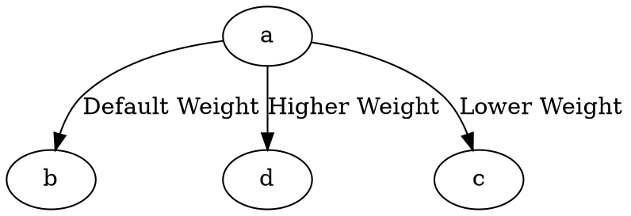

# Weight

The **weight** attribute controls **edge routing priority** in **the DOT layout engine only**. It affects how edges are ranked and routed, influencing **edge length and straightness**.

------

## **Behavior**

- **Applies only in the DOT layout engine**.
- **Higher weight (`weight > 1`)** → The edge is **straighter and shorter**.
- **Lower weight (`weight < 1`)** → The edge is **more flexible and may take longer routes**.
- **Default weight = 1** → Standard edge routing behavior in the DOT engine.

------

## **Usage in DOT**



### **Explanation**

- **`a -> b`** → Uses the **default weight** (`weight=1`).
- **`a -> d`** → A **higher weight (5)** makes the edge **straighter and shorter**.
- **`a -> c`** → A **lower weight (2)** allows a **more flexible path**.

⚠ **Important:** This attribute only works in **DOT layout**. Other Graphviz layout engines will ignore it.

------

## **Usage in Java**

```java
Node a = Node.builder().id("a").build();
Node b = Node.builder().id("b").build();
Node c = Node.builder().id("c").build();
Node d = Node.builder().id("d").build();

// Default weight (1)
Line defaultEdge = Line.builder(a, b)
    .label("Default Weight")
    .build();

// Higher weight → shorter, straighter edge
Line highWeightEdge = Line.builder(a, d)
    .label("Higher Weight")
    .weight(5) // Edge is straighter and more direct
    .build();

// Lower weight → more flexible edge
Line lowWeightEdge = Line.builder(a, c)
    .label("Lower Weight")
    .weight(2) // Edge may take a longer path
    .build();

Graphviz graph = Graphviz.digraph()
    .addLine(defaultEdge)
    .addLine(highWeightEdge)
    .addLine(lowWeightEdge)
    .build();
```

✅ **`.weight(double value)`** → Adjusts **edge priority in routing** **only for the DOT layout engine**.