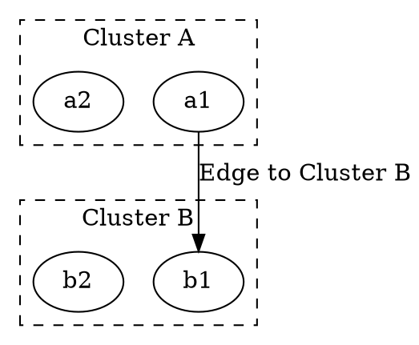

# lhead

The **lhead** attribute is used in **subgraph clustering** to specify that an edge **terminates inside a cluster** (subgraph). This helps visualize **hierarchical relationships** and ensures that the edge connects **to the entire cluster rather than a specific node inside it**.

------

## **Behavior**

- **Works only when clusters (`subgraph cluster_x`) are defined**.
- **Edges with `lhead="cluster_X"` will terminate inside the cluster** instead of a single node.
- **Useful for grouping related nodes visually**.
- **Works in combination with `ltail` (controlling where the edge starts).**

------

## **Usage in DOT**



### **Explanation**

- **`subgraph cluster_0` and `subgraph cluster_1`** → Define **two clusters** (`Cluster A` and `Cluster B`).
- **`a1 -> b1 [lhead="cluster_1"]`** → The edge **targets the entire cluster_1** instead of a specific node (`b1`).
- **Result** → The arrow points to the **border of Cluster B** rather than a node inside it.

------

## **Usage in Java**

```java
Node a1 = Node.builder().id("a1").build();
Node a2 = Node.builder().id("a2").build();
Node b1 = Node.builder().id("b1").build();
Node b2 = Node.builder().id("b2").build();

// Edge terminates at the entire cluster_1
Line edgeToCluster = Line.builder(a1, b1)
    .label("Edge to Cluster B")
    .lHead("cluster_1") // Targets the entire cluster instead of a single node
    .build();

Graphviz graph = Graphviz.digraph()
    // Define first cluster
    .cluster(
        Cluster.builder()
            .id("cluster_0")
            .label("Cluster A")
            .style(ClusterStyle.DASHED)
            .addNode(a1, a2)
            .build()
    )
    
    // Define second cluster
    .cluster(
        Cluster.builder()
            .id("cluster_1")
            .label("Cluster B")
            .style(ClusterStyle.DASHED)
            .addNode(b1, b2)
            .build()
    )

    // Add edge
    .addLine(edgeToCluster)
    .build();
```