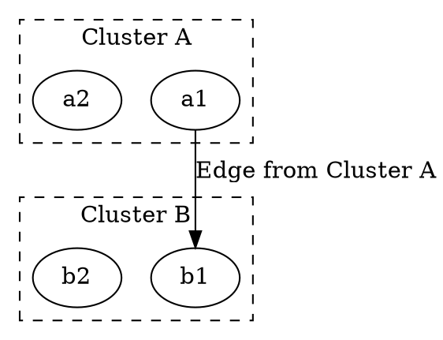

# ltail

The **ltail** attribute is used in **subgraph clustering** to specify that an edge **originates from inside a cluster** (subgraph). This ensures that the edge appears to be coming **from the entire cluster rather than from a specific node inside it**.

------

## **Behavior**

- **Works only when clusters (`subgraph cluster_x`) are defined**.
- **Edges with `ltail="cluster_X"` will originate from the cluster boundary** instead of a single node.
- **Useful for visually grouping related nodes and maintaining hierarchy clarity**.
- **Often used together with `lhead` to define both the start (`ltail`) and end (`lhead`) of an edge**.

------

## **Usage in DOT**



### **Explanation**

- **`subgraph cluster_0` and `subgraph cluster_1`** → Define **two clusters** (`Cluster A` and `Cluster B`).
- **`a1 -> b1 [ltail="cluster_0"]`** → The edge **originates from the entire cluster_0** rather than from a specific node (`a1`).
- **Result** → The edge **starts from the border of Cluster A** instead of appearing to come from a single node.

------

## **Usage in Java**

```java
Node a1 = Node.builder().id("a1").build();
Node a2 = Node.builder().id("a2").build();
Node b1 = Node.builder().id("b1").build();
Node b2 = Node.builder().id("b2").build();

// Edge originates from the entire cluster_0
Line edgeFromCluster = Line.builder(a1, b1)
    .label("Edge from Cluster A")
    .ltail("cluster_0") // Edge originates from the cluster instead of a single node
    .build();

Graphviz graph = Graphviz.digraph()
    // Define first cluster
    .cluster(
        Cluster.builder()
            .id("cluster_0")
            .label("Cluster A")
            .addNode(a1, a2)
            .build()
    )

    // Define second cluster
    .cluster(
        Cluster.builder()
            .id("cluster_1")
            .label("Cluster B")
            .addNode(b1, b2)
            .build()
    )

    // Add edge
    .addLine(edgeFromCluster)
    .build();
```