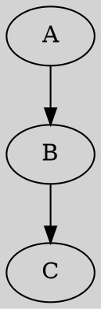

# FillColor

The **fillcolor** attribute sets the **background color** of the entire graph.
 It has an **alias `bgcolor`**, meaning **both attributes function identically**.

------

## **Behavior**

- **Affects the entire graph background color.**
- **If not set, the default background is transparent.**
- **Supports named colors (e.g., `lightgrey`, `blue`, `red`).**
- **Supports hexadecimal colors (e.g., `#FFD700` for gold).**
- **Does NOT support gradient colors.**

------

## **Usage in DOT**



### **Explanation**:

- **`fillcolor=lightgrey`** → Sets the **background color of the entire graph**.
- **`bgcolor=lightgrey`** → Works **exactly the same as `fillcolor`**.
- **Nodes use `fillcolor=white`** to differentiate from the background.

------

## **Usage in Java**

```java
Graphviz graph = Graphviz.digraph()
    .bgColor(Color.LIGHT_GREY)  // Sets the background color of the graph (same as bgColor)
    .addNode(Node.builder().id("A").fillColor(Color.WHITE).build())
    .addNode(Node.builder().id("B").fillColor(Color.WHITE).build())
    .build();
```

Color detail see [Color Intro](../Color Intro)