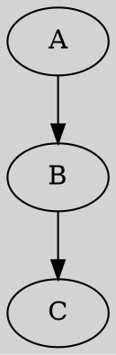

# FillColor

The **fillcolor** attribute sets the **background color** of the entire graph.
 It has an **alias `bgcolor`**, meaning **both attributes function identically**.

------

## **Behavior**

- **Affects the entire graph background color.**
- **If not set, the default background is white.**
- **Use `transparent` for an SVG/PNG background with alpha.**
- **Supports named colors (e.g., `lightgrey`, `blue`, `red`).**
- **Supports hexadecimal colors (e.g., `#FFD700` for gold).**
- **Does NOT support gradient colors.**

------

## **Usage in DOT**


```dot
digraph G {
    fillcolor=lightgrey;  // Sets the graph background color
    bgcolor=lightgrey;     // Same as fillcolor (alias)
    
    node [fillcolor=white];
    
    A -> B;
    B -> C;
}
```

Transparent background:

```dot
digraph G {
    bgcolor=transparent;
    // style=transparent is accepted as a compatibility alias.
    A -> B;
}
```

### **Explanation**:

- **`fillcolor=lightgrey`** → Sets the **background color of the entire graph**.
- **`bgcolor=lightgrey`** → Works **exactly the same as `fillcolor`**.
- **Nodes use `fillcolor=white`** to differentiate from the background.

------

## **Usage in Java**

```java
Graphviz graph = Graphviz.digraph()
    .bgColor(Color.LIGHT_GREY)  // Sets the background color of the graph (same as bgColor)
    .addNode(Node.builder().id("A").fillColor(Color.WHITE).build())
    .addNode(Node.builder().id("B").fillColor(Color.WHITE).build())
    .build();
```

```java
Graphviz transparent = Graphviz.digraph()
    .bgColor(Color.TRANSPARENT)
    .build();
```

SVG uses `fill="none"`, and PNG export preserves the alpha channel.

Color details: [Color Intro](../Color%20Intro.md).
