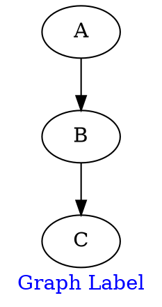

# FontColor

The **fontcolor** attribute sets the **color of text labels** for the entire **graph**.
 It **does not affect nodes, edges, or cluster text**, only the **graph-level label**.

------

## **Behavior**

- **Affects the color of the graph’s label text**.
- **Does NOT affect node or edge labels** (use `node[fontcolor=...]` or `edge[fontcolor=...]` instead).
- **Supports named colors** (e.g., `red`, `blue`, `green`).
- **Supports hexadecimal colors** (e.g., `#FF4500` for orange-red).

------

## **Usage in DOT**



### **Explanation**:

- **`label="Graph Label"`** → Defines a **text label for the entire graph**.
- **`fontcolor=blue`** → Makes the **graph label text blue**.
- **Does not affect node labels** (they remain black unless specified separately).

------

## **Usage in Java**

```java
Graphviz graph = Graphviz.digraph()
    .label("Graph Label")
    .fontColor(Color.BLUE)  // Sets the color of the graph label
    .addNode(Node.builder().id("A").fillColor(Color.WHITE).build())
    .addNode(Node.builder().id("B").fillColor(Color.WHITE).build())
    .build();
```

Color detail see [Color Intro](../Color Intro)