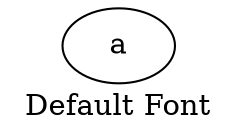
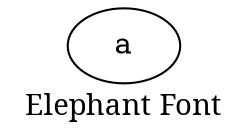
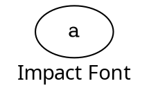

# FontName

The **fontname** attribute specifies the **font family** used to render the **graph label**. This allows customization of the label’s typography.

------

## **Behavior**

- **Applies only to the graph label (`label="..."`)**.
- **Controls the font family used for rendering the label**.
- **Must use a font available on the system**; otherwise, Graphviz defaults to a system font.
- **Common font families include**: Arial, Times New Roman, Courier, Impact, Verdana.
- **Works in combination with `fontsize` and `fontcolor` for further styling**.

------

## **Usage in DOT**

### **Default Font**



### **Elephant Font**



### **Impact Font**



------

## **Usage in Java**

### **Default Font**

```java
Graphviz graph = Graphviz.digraph()
    .label("Default Font")  // Uses Graphviz's default font
    .addNode(Node.builder().build())
    .build();
```

### **Elephant Font**

```java
Graphviz graph = Graphviz.digraph()
    .label("Elephant  Font")
    .fontName("Elephant")  // Uses Elephant font
    .addNode(Node.builder().build())
    .build();
```

### **Impact Font**

```java
Graphviz graph = Graphviz.digraph()
    .label("Impact Font")
    .fontName("Impact")  // Uses Impact font
    .addNode(Node.builder().build())
    .build();
```