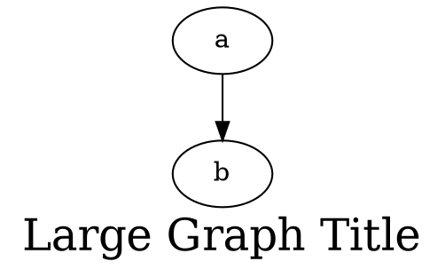

# **Fontsize**

The **fontsize** attribute controls the **default font size** for the entire graph, including the **graph title (label)**. It sets the base text size for graph-related labels.

------

## **Usage in DOT**

### **Increase Font Size for Graph Title**



------

## **Usage in Java**

### **Increase Font Size for Graph Title**

```java
Node a = Node.builder().label("a").build();
Node b = Node.builder().label("b").build();

Graphviz graph = Graphviz.digraph()
    .fontSize(24)  // Sets title font size
    .label("Large Graph Title")
    .addLine(a, b)
    .build();
```

