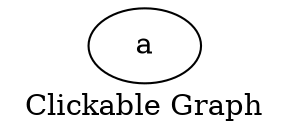

# **Href**

The **href** attribute (alias: **url**) adds a **clickable hyperlink** to the entire graph, making the graph title interactive in `SVG` outputs.

------

## **Examples**

### **DOT Syntax**



------

### **Java Usage**

```java
Node a = Node.builder().label("a").build();

Graphviz graph = Graphviz.digraph()
    .label("Clickable Graph")
    .href("https://github.com/") // Set hyperlink
    .addNode(a)
    .build();
```