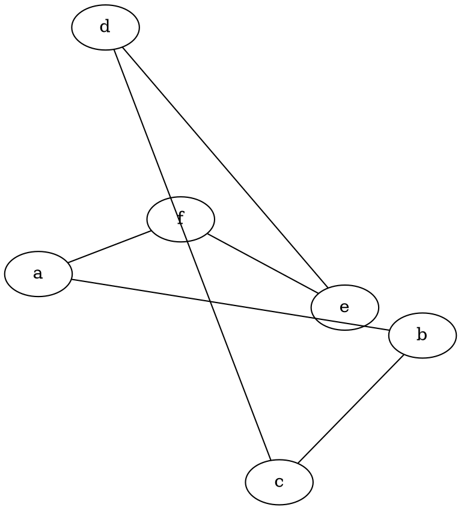
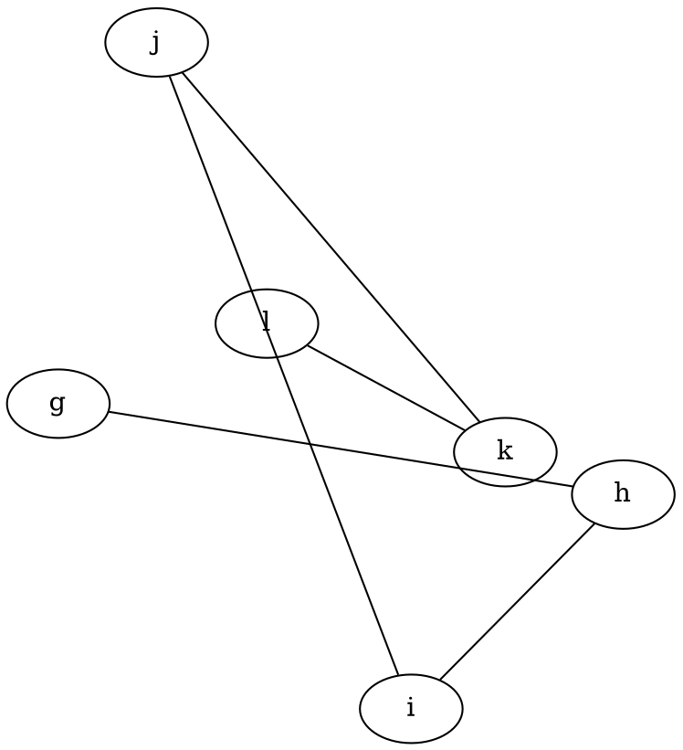
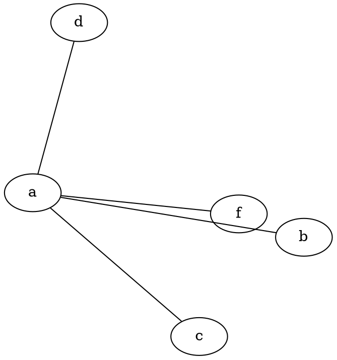

# **Initpos**

The **initpos** attribute specifies the **initial node placement strategy** for **force-directed (FDP) layout algorithms**. It determines how nodes are arranged before iterative layout refinement begins.

------

## **Behavior**

- **Applies to force-directed layouts** (`fdp`, `jfdp`, `gfdp`).
- **Determines the initial node positions before running the layout algorithm.**
- **Affects the convergence speed and final layout stability.**
- Works in combination with `maxiter`:
  - If **`maxiter > 0`**, the layout will refine from the initial positions.
  - If **`maxiter = 0`**, the initial positions are used as the final layout.
- Available values:
  - `"grid"` → Initializes nodes in a **grid pattern**.
  - `"circle"` → Arranges nodes in a **circular pattern**.
  - `"sector"` → Distributes nodes in **sectors**.

------

## **Usage in DOT**

### **Initialize Nodes in a Circular Pattern with No Refinement**



### **Use Grid-Based Initialization with No Refinement**



### **Use Sector-Based Initialization with No Refinement**



- **Setting `maxiter=0` freezes the graph at the initial layout, preventing further refinements.**

------

## **Usage in Java**

```java
Node a = Node.builder().label("a").build();
Node b = Node.builder().label("b").build();
Node c = Node.builder().label("c").build();
Node d = Node.builder().label("d").build();
Node e = Node.builder().label("e").build();
Node f = Node.builder().label("f").build();

Graphviz graph = Graphviz.graph()
    .layout(Layout.FDP)
    .initPos(InitPos.CIRCLE)  // Nodes start in a circular pattern
    .maxiter(0) 
    .addLine(a, b)
    .addLine(b, c)
    .addLine(c, d)
    .addLine(d, e)
    .addLine(e, f)
    .addLine(a, f)
    .build();
```

