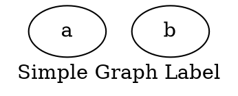
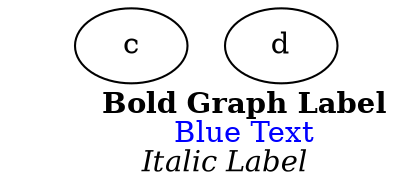
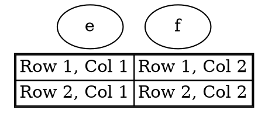

# Label

The **label** attribute in Graphviz sets a **global label** for the entire graph. This label is **displayed outside the graph** (typically centered above or below the graph). It supports **rich text formatting** using `LabelTag` and **table structures** for complex layouts.

------

## **Behavior**

- **Applies to the entire graph** (not individual nodes or edges).
- **Displays text outside the main graph area**.
- **Supports rich text formatting** using `LabelTag`.
- **Allows structured content** using tables.
- **Typically centered above the graph but can be adjusted** using `labelloc`.

------

## **Usage in DOT**

### **Simple Graph Label**



### **Rich Text Formatting using [LabelTag](../LabelTag.md)**



### **Structured Graph Label using [Tables](../Table.md)**



------

## **Usage in Java**

### **Simple Graph Label**

```java
Graphviz graph = Graphviz.digraph()
    .label("Simple Graph Label")  // Sets a plain text title for the entire graph
    .addNode(Node.builder().id("a").build())
    .addNode(Node.builder().id("b").build())
    .build();
```

### **Rich Text Formatting using LabelTag**

```java
Graphviz graph = Graphviz.digraph()
    .labelTag(
        bold("Bold Graph Label").br()
            .font("Blue Text", fontAttrs().color(Color.BLUE)).br()
            .italic("Italic Label")
    )
    .addNode(Node.builder().id("c").build())
    .addNode(Node.builder().id("d").build())
    .build();
```

### **Structured Graph Label using Tables**

```java
Graphviz graph = Graphviz.digraph()
    .table(
        table()
            .border(1)
            .cellBorder(1)
            .cellSpacing(0)
            .tr(td().text("Row 1, Col 1"), td().text("Row 1, Col 2"))
            .tr(td().text("Row 2, Col 1"), td().text("Row 2, Col 2"))
    )
    .addNode(Node.builder().id("e").build())
    .addNode(Node.builder().id("f").build())
    .build();
```