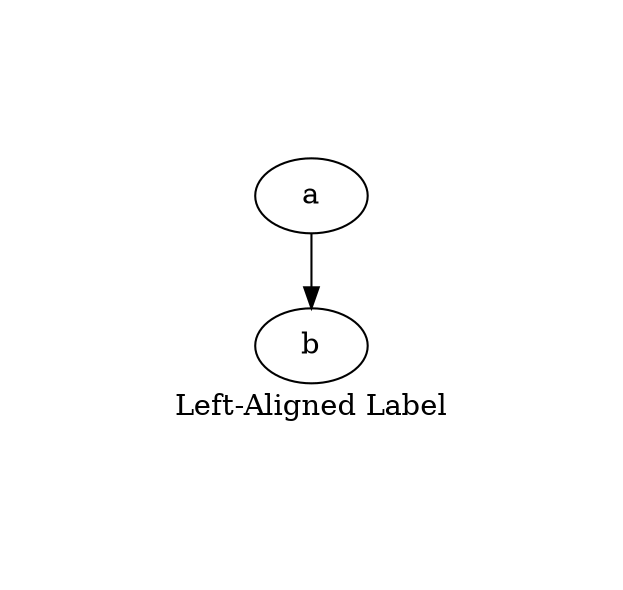
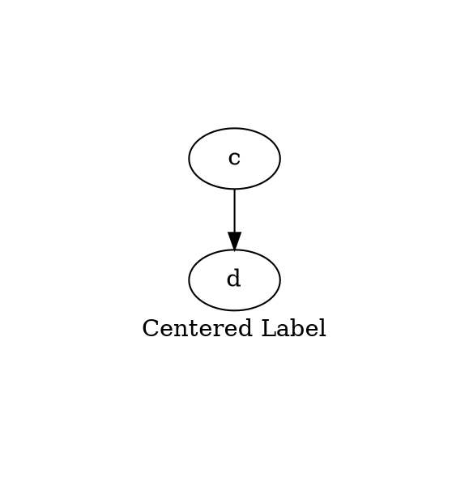
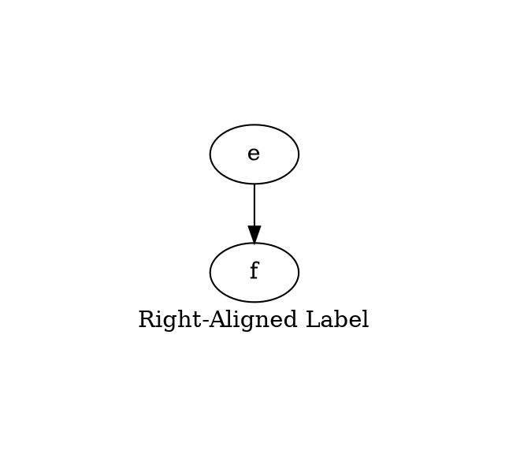

# Labeljust

The **labeljust** attribute controls the **horizontal alignment** of the **graph's label** relative to the graph container. By default, the label is **centered** within the graph.

------

## **Behavior**

- **Only applies to the graph label (`label="..."`)**.
- **Controls the horizontal alignment within the graph container**.
- **Does not affect the positioning of the label outside the graph** (use `labelloc` for vertical alignment).
- **Has no effect if the label is a multi-line text or table**.
- **Default value is `c` (centered)**.

------

## **Usage in DOT**

### **Left-Aligned Label**



### **Centered Label (Default)**



### **Right-Aligned Label**



------

## **Usage in Java**

### **Left-Aligned Label**

```java
Graphviz graph = Graphviz.digraph()
    .label("Left-Aligned Label")
    .labeljust(Labeljust.LEFT)  // Aligns label to the left
    .margin(1.0)  // Adds space for better visibility
    .addNode(Node.builder().id("a").build())
    .addNode(Node.builder().id("b").build())
    .build();
```

### **Centered Label (Default)**

```java
Graphviz graph = Graphviz.digraph()
    .label("Centered Label")
    .labeljust(Labeljust.CENTER)  // Default behavior (centered)
    .margin(1.0)  // Adds space for better visibility
    .addNode(Node.builder().id("c").build())
    .addNode(Node.builder().id("d").build())
    .build();
```

### **Right-Aligned Label**

```java
Graphviz graph = Graphviz.digraph()
    .label("Right-Aligned Label")
    .labeljust(Labeljust.RIGHT)  // Aligns label to the right
    .margin(1.0)  // Adds space for better visibility
    .addNode(Node.builder().id("e").build())
    .addNode(Node.builder().id("f").build())
    .build();
```