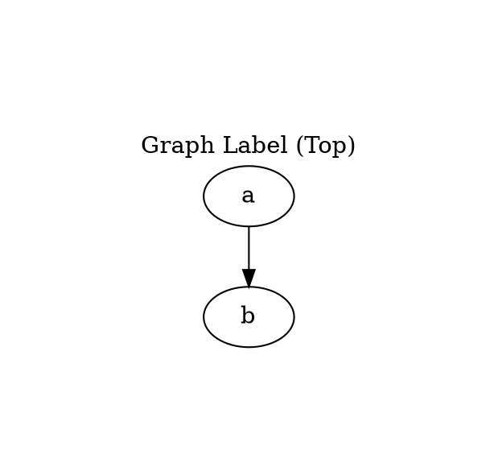
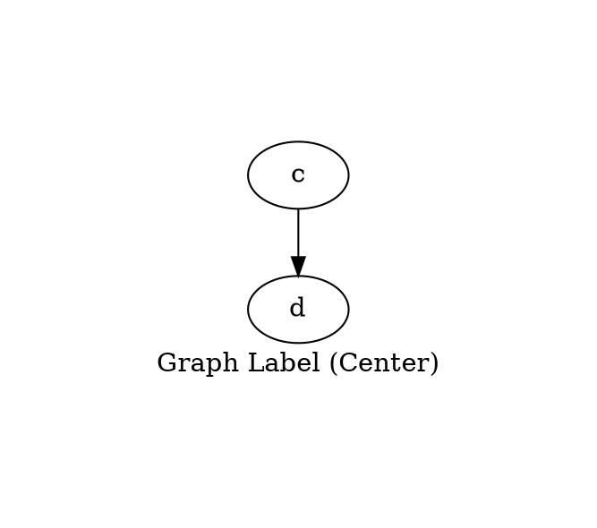
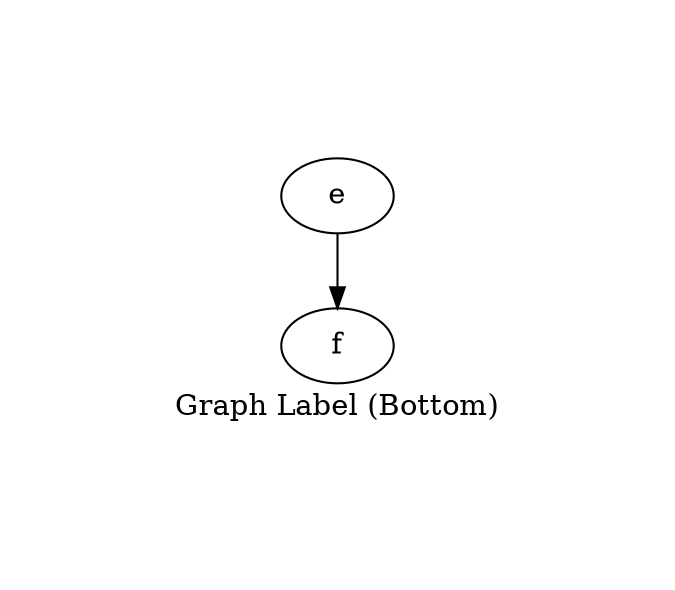

# Labelloc

The **labelloc** attribute controls the **vertical positioning** of the **graph's label**. It determines whether the **graph title appears at the top, center, or bottom of the graph**.

------

## **Behavior**

- **Only applies to the graph label** (`label="..."`).
- **Affects vertical positioning**, aligning the label at the **top, center, or bottom** of the graph.
- **Works only when a `label` is set**.
- **Default value is `top`**, meaning the label appears **above the graph**.
- **Adding `margin` ensures better visibility** of the label position.

------

## **Usage in DOT**

### **Label at the Top (Default)**



### **Label at the Center**



### **Label at the Bottom**



------

## **Usage in Java**

### **Label at the Top (Default)**

```java
Graphviz graph = Graphviz.digraph()
    .label("Graph Label (Top)")
    .labelloc(Labelloc.TOP) // Default position (Top)
    .margin(1.0)  // Adds space for better visibility
    .addNode(Node.builder().id("a").build())
    .addNode(Node.builder().id("b").build())
    .build();
```

### **Label at the Center**

```java
Graphviz graph = Graphviz.digraph()
    .label("Graph Label (Center)")
    .labelloc(Labelloc.CENTER) // Centered label
    .margin(1.0)  // Adds space for better visibility
    .addNode(Node.builder().id("c").build())
    .addNode(Node.builder().id("d").build())
    .build();
```

### **Label at the Bottom**

```java
Graphviz graph = Graphviz.digraph()
    .label("Graph Label (Bottom)")
    .labelloc(Labelloc.BOTTOM) // Bottom-aligned label
    .margin(1.0)  // Adds space for better visibility
    .addNode(Node.builder().id("e").build())
    .addNode(Node.builder().id("f").build())
    .build();
```