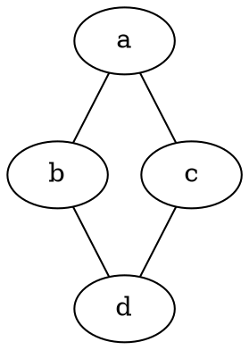
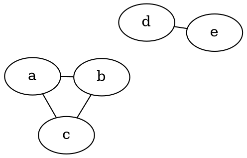

# Layout

The **layout** attribute controls the **algorithm used to arrange nodes and edges** in the graph. Different layout engines produce **different visual structures** based on their algorithms.

------

## **Quick Start**

For **most directed graphs**, use **DOT** (the core layout engine):
```dot
graph G {
    layout=dot   # Core hierarchical layout (default)
    // your graph content
}
```

For **large directed graphs** (1000+ nodes) where performance matters, use **DOTQ**:
```dot
graph G {
    layout=dotq  # Optimized for performance on large graphs
    // your graph content
}
```

For **undirected graphs**, use **FDP**:
```dot
graph G {
    layout=fdp   # Force-directed for undirected graphs
    // your graph content
}
```

------

## **Supported Layouts and Behavior**

| **Layout** | **Description**                                              |
| ---------- | ------------------------------------------------------------ |
| **DOT**    | **Core hierarchical layout** for directed graphs. Tries to keep edges in a consistent direction (e.g., top to bottom or left to right). Reduces edge crossings and optimizes edge length. Provides the **highest quality layout** and is the **default choice** for most directed graphs. |
| **DOTQ**   | **Optimized hierarchical layout** for directed graphs. Similar to DOT but with improved performance for **large graphs (1000+ nodes)** through optimized x-position calculation. Provides faster layout times while maintaining good visual quality. |
| **FDP**    | **Force-directed placement (FDP)**, where nodes are treated as charged particles that repel each other, and edges act as springs pulling nodes together. Ideal for **undirected graphs**. |
| **JFDP**   | **Optimized force-directed placement (JFDP)** with improved stability, degree-based scaling of attractive forces, and efficient repulsion calculations. |
| **GFDP**   | **Grid-based force-directed placement (GFDP)**, optimized for **dense graphs** by considering only local node interactions within their cell area. Reduces computational complexity. |

------

## **DOT vs DOTQ: When to Use Each**

| **Aspect** | **DOT** | **DOTQ** |
|------------|---------|----------|
| **Quality** | ⭐⭐⭐⭐⭐ Highest quality layout | ⭐⭐⭐⭐ Good quality layout |
| **Performance** | ⭐⭐⭐ Good for small-medium graphs | ⭐⭐⭐⭐⭐ Better for large graphs |
| **Algorithm** | Classic network simplex | Optimized network simplex + Brandes/Köpf |
| **Default nslimit** | 100,000 | 5,000 |
| **Best for** | Most directed graphs, highest quality requirements | Large graphs (1000+ nodes), performance requirements |
| **When to use** | Default choice, small-medium graphs, quality-critical applications | Large graphs where DOT performance is insufficient |

**💡 Recommendation**: Start with **DOT** for most use cases. Switch to **DOTQ** only when you have large graphs (1000+ nodes) and need better performance.

------

## **DOTQ Technical Details**

**DOTQ** (Quick DOT) is an optimized version of the classic DOT algorithm that:

- **Combines algorithms**: Uses network simplex for global optimization + Brandes/Köpf for local positioning
- **Reduces iterations**: Lower default `nslimit` (5,000 vs 100,000) for faster convergence
- **Optimizes x-positioning**: More efficient coordinate calculation while maintaining hierarchy
- **Maintains quality**: Preserves the hierarchical structure and edge routing quality
- **Scales better**: Performance degradation is more gradual with graph size

The algorithm is particularly effective for graphs with:
- 1000+ nodes
- Complex hierarchical structures
- Multiple clusters
- Performance requirements

------

## **Usage Examples**

### **DOT for Most Use Cases (Default)**



### **DOTQ for Large Graphs**

```dot
graph G {
    layout=dotq  # Use optimized DOT for large graphs
    a--b
    a--b
    a--c
    a--c
    a--d
    a--d
    a--e
    a--e
    b--c
    b--c
    b--d
    b--d
    b--e
    b--e
    c--d
    c--d
    c--e
    c--e
    d--e
    d--e
}
```

### **FDP for Undirected Graphs**



### **Explanation:**

- **`layout=dot`** → Uses the **core hierarchical layout** (default choice for most directed graphs).
- **`layout=dotq`** → Uses the **optimized hierarchical layout** (best for large directed graphs with 1000+ nodes).
- **`layout=fdp`** → Uses a **force-directed layout** (best for undirected graphs).

------

## **Usage in Java**

```java
// Define nodes
Node a = Node.builder().label("a").build();
Node b = Node.builder().label("b").build();
Node c = Node.builder().label("c").build();
Node d = Node.builder().label("d").build();
Node e = Node.builder().label("e").build();

// Define graph with DOT layout (default)
Graphviz graph = Graphviz.graph()
    .layout(Layout.DOT) // Use core DOT layout
    .addLine(Line.builder(a, b).build())
    .addLine(Line.builder(a, c).build())
    .addLine(Line.builder(b, d).build())
    .addLine(Line.builder(c, d).build())
    .build();
```

### **Performance Comparison**

```java
// For most graphs, use DOT (default)
Graphviz standardGraph = Graphviz.graph()
    .layout(Layout.DOT)   // Default choice, highest quality
    // ... add nodes and edges
    .build();

// For large graphs (1000+ nodes), use DOTQ for better performance
Graphviz largeGraph = Graphviz.graph()
    .layout(Layout.DOTQ)  // Better performance for large graphs
    // ... add many nodes and edges
    .build();
```