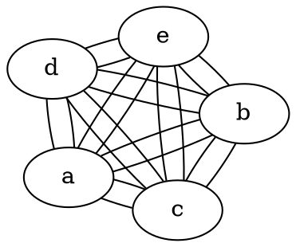

# Layout

The **layout** attribute controls the **algorithm used to arrange nodes and edges** in the graph. Different layout engines produce **different visual structures** based on their algorithms.

------

## **Supported Layouts and Behavior**

| **Layout** | **Description**                                              |
| ---------- | ------------------------------------------------------------ |
| **DOT**    | **Hierarchical layout** for directed graphs. Tries to keep edges in a consistent direction (e.g., top to bottom or left to right). Reduces edge crossings and optimizes edge length. |
| **FDP**    | **Force-directed placement (FDP)**, where nodes are treated as charged particles that repel each other, and edges act as springs pulling nodes together. Ideal for **undirected graphs**. |
| **JFDP**   | **Optimized force-directed placement (JFDP)** with improved stability, degree-based scaling of attractive forces, and efficient repulsion calculations. |
| **GFDP**   | **Grid-based force-directed placement (GFDP)**, optimized for **dense graphs** by considering only local node interactions within their cell area. Reduces computational complexity. |

------

## **Usage in DOT**



### **Explanation:**

- **`layout=dot`** → Uses a **hierarchical layout** (best for directed graphs).
- **`layout=fdp`** → Uses a **force-directed layout** (best for undirected graphs).

------

## **Usage in Java**

```java
// Define nodes
Node a = Node.builder().label("a").build();
Node b = Node.builder().label("b").build();
Node c = Node.builder().label("c").build();
Node d = Node.builder().label("d").build();
Node e = Node.builder().label("e").build();

// Define graph with FDP layout
Graphviz graph = Graphviz.graph()
    .layout(Layout.FDP) // Use force-directed placement (FDP)
    .addLine(Line.builder(a, b).build())
    .addLine(Line.builder(a, b).build())
    .addLine(Line.builder(a, c).build())
    .addLine(Line.builder(a, c).build())
    .addLine(Line.builder(a, d).build())
    .addLine(Line.builder(a, d).build())
    .addLine(Line.builder(a, e).build())
    .addLine(Line.builder(a, e).build())
    .addLine(Line.builder(b, c).build())
    .addLine(Line.builder(b, c).build())
    .addLine(Line.builder(b, d).build())
    .addLine(Line.builder(b, d).build())
    .addLine(Line.builder(b, e).build())
    .addLine(Line.builder(b, e).build())
    .addLine(Line.builder(c, d).build())
    .addLine(Line.builder(c, d).build())
    .addLine(Line.builder(c, e).build())
    .addLine(Line.builder(c, e).build())
    .addLine(Line.builder(d, e).build())
    .addLine(Line.builder(d, e).build())
    .build();
```