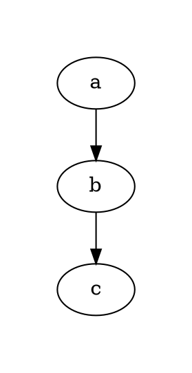

# Margin

The **margin** attribute controls the **padding around the graph drawing area**. It defines the extra space between the **graph content** and the **bounding box**.

------

## **Usage in DOT**

### **Set Uniform Margin Around Graph**



------

## **Usage in Java**

### **Set Uniform Margin Around Graph**

```java
Node a = Node.builder().label("a").build();
Node b = Node.builder().label("b").build();
Node c = Node.builder().label("c").build();

Graphviz graph = Graphviz.digraph()
    .margin(0.5)  // Adds 0.5-inch padding around the graph
    .addLine(a, b)
    .addLine(b, c)
    .build();
```