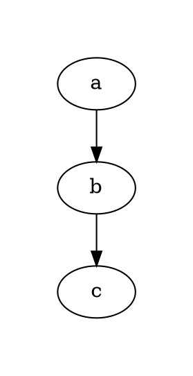
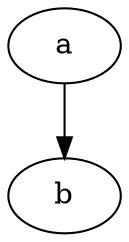

# Margin

The **margin** attribute controls the **padding around the graph drawing area**. It defines the extra space between the **graph content** and the **bounding box**.

------

## **Usage in DOT**

### **Set Uniform Margin Around Graph**


```dot
digraph G {
    margin=0.5;  // Adds 0.5-inch padding around the graph
    a -> b;
    b -> c;
}
```

------

## **Usage in Java**

### **Set Uniform Margin Around Graph**

```java
Node a = Node.builder().label("a").build();
Node b = Node.builder().label("b").build();
Node c = Node.builder().label("c").build();

Graphviz graph = Graphviz.digraph()
    .margin(0.5)  // Adds 0.5-inch padding around the graph
    .addLine(a, b)
    .addLine(b, c)
    .build();
```

## Zero Margin SVG

An explicit zero margin asks the SVG renderer to tighten the final canvas around drawable content:


```dot
digraph G {
    margin="0,0";
    a -> b;
}
```

```java
Graphviz graph = Graphviz.digraph()
    .margin(0)
    .addLine(a, b)
    .build();
```

Layout and routing still use their normal safety space. After routing completes, the SVG canvas is
recomputed from nodes, clusters, paths, arrowheads, and labels, with a 2-pixel antialiasing safety
edge. Non-zero margins are unchanged.
