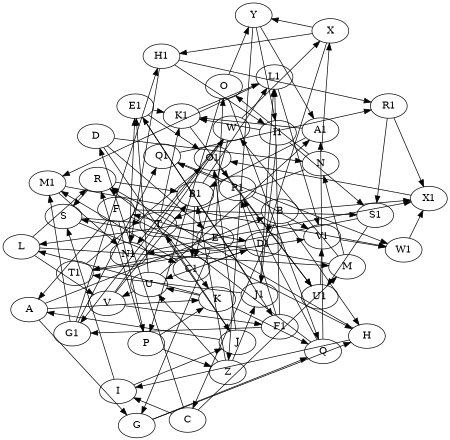

# Maxiter

The **maxiter** attribute sets the **maximum number of iterations** for **force-directed (FDP) layout algorithms**. It controls the number of refinement steps used to optimize node placement.

------

## **Usage in DOT**

### **Increase Iterations for a More Refined Layout**



------

## **Usage in Java**

### **Increase Iterations for a More Refined Layout**

```java
Node a = Node.builder().label("a").build();
Node b = Node.builder().label("b").build();

Graphviz graph = Graphviz.digraph()
    .layout(Layout.FDP)  // Use force-directed layout
    .maxiter(500)  // Increase iterations for better optimization
    .addLine(a, b)
    .build();
```