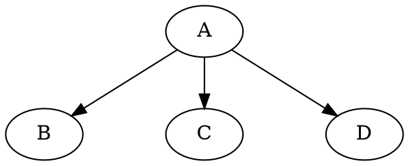

# Nodesep

The **nodesep** attribute **controls the minimum spacing between adjacent nodes** in the **same rank (horizontal or vertical distance)** depending on the `rankdir` setting.

------

## **Behavior**

- **Defines the minimum space between nodes in the same rank (row or column).**
- **Higher values increase spacing, making graphs more spread out.**
- **Smaller values reduce spacing, making graphs more compact.**
- **Only applies to `DOT` layout** (ignored in `FDP`, `GFDP`, `JFDP`, etc.).**

------

## **Usage in DOT**



------

## **Usage in Java**

```java
// Define nodes
Node a = Node.builder().label("a").build();
Node b = Node.builder().label("b").build();
Node c = Node.builder().label("c").build();
Node d = Node.builder().label("d").build();

Graphviz graph = Graphviz.digraph()
    .nodeSep(0.8)  // Increase spacing between nodes in the same rank
    .addLine(Line.builder(a, b).build())
    .addLine(Line.builder(a, c).build())
    .addLine(Line.builder(a, d).build())
    .build();
```