# Nslimit1

The **nslimit1** attribute controls the **maximum number of network simplex iterations** used during node ranking in the **DOT** layout engine. It helps **optimize layout computation** by limiting the number of iterations.

------

## **Behavior**

- **Applies only to the `DOT` layout engine** (ignored in other layouts like FDP, GFDP, JFDP).
- **Limits the number of iterations used in the ranking phase** of the layout.
- **Helps prevent excessive computation in large graphs**.

------

## **Key Differences Between `nslimit` and `nslimit1`**

| Attribute      | Applies To                                      | Effect                                                       |
| -------------- | ----------------------------------------------- | ------------------------------------------------------------ |
| **`nslimit`**  | **All passes** of the network simplex algorithm | Limits total ranking iterations, affecting the final layout quality. |
| **`nslimit1`** | **First pass only**                             | Limits iterations for the initial ranking phase, affecting how nodes are placed initially. |

🔹 **If `nslimit1` is set too low, the initial ranking might be poor**, leading to **worse node placement** and more **edge crossings**.
 🔹 **A higher `nslimit1`** allows the **first pass** to perform more **ranking adjustments**, leading to **better layouts**.

------

## **Example: DOT Graph Showing `nslimit1` Effect**

The following example demonstrates how `nslimit1` affects **initial node ranking** in a **large graph with multiple cycles and cross-links**.

```dot
digraph G {
    layout=dot;
    size=3
    nslimit1=1; // Limits network simplex iterations to 5

    node [shape=ellipse];

    // Define 50+ nodes
    A; B; C; D; E; F; G; H; I; J;
    K; L; M; N; O; P; Q; R; S; T;
    U; V; W; X; Y; Z; A1; B1; C1; D1;
    E1; F1; G1; H1; I1; J1; K1; L1; M1; N1;
    O1; P1; Q1; R1; S1; T1; U1; V1; W1; X1;

    // First cycle group
    A -> B; B -> C; C -> D; D -> E; E -> F; F -> A;
    A -> G; G -> H; H -> I; I -> J; J -> A;
    B -> H; C -> I; D -> J; E -> G; F -> H;

    // Second cycle group
    K -> L; L -> M; M -> N; N -> O; O -> P; P -> K;
    K -> Q; Q -> R; R -> S; S -> T; T -> K;
    L -> R; M -> S; N -> T; O -> Q; P -> R;

    // Third cycle group
    U -> V; V -> W; W -> X; X -> Y; Y -> Z; Z -> U;
    U -> A1; A1 -> B1; B1 -> C1; C1 -> D1; D1 -> U;
    V -> B1; W -> C1; X -> D1; Y -> A1; Z -> B1;

    // Fourth cycle group
    E1 -> F1; F1 -> G1; G1 -> H1; H1 -> I1; I1 -> J1; J1 -> E1;
    E1 -> K1; K1 -> L1; L1 -> M1; M1 -> N1; N1 -> E1;
    F1 -> L1; G1 -> M1; H1 -> N1; I1 -> K1; J1 -> L1;

    // Fifth cycle group
    O1 -> P1; P1 -> Q1; Q1 -> R1; R1 -> S1; S1 -> T1; T1 -> O1;
    O1 -> U1; U1 -> V1; V1 -> W1; W1 -> X1; X1 -> O1;
    P1 -> V1; Q1 -> W1; R1 -> X1; S1 -> U1; T1 -> V1;

    // Cross connections between groups
    A -> K; B -> L; C -> M; D -> N; E -> O; F -> P;
    G -> Q; H -> R; I -> S; J -> T;
    K -> U; L -> V; M -> W; N -> X; O -> Y; P -> Z;
    Q -> A1; R -> B1; S -> C1; T -> D1;
    U -> E1; V -> F1; W -> G1; X -> H1; Y -> I1; Z -> J1;
    A1 -> K1; B1 -> L1; C1 -> M1; D1 -> N1;
    E1 -> O1; F1 -> P1; G1 -> Q1; H1 -> R1; I1 -> S1; J1 -> T1;
    K1 -> U1; L1 -> V1; M1 -> W1; N1 -> X1;

    // Additional long-range connections
    B -> X1; F -> S1; J -> O1; T -> K1; Q -> P1; W -> N1;
}
```



### **Explanation**

- **50+ nodes**, **5 distinct cycle groups**, **dense cross-links**.
- **Initial node ranking** is constrained to **5 iterations** due to `nslimit1=5`.
- The **quality of initial ranking** will impact the **final placement** of nodes.
- If `nslimit1` is **too low**, the **first pass fails to optimize ranking**, leading to **suboptimal positioning**.

------

## **Equivalent Java Code**

```java
// Define nodes
Node a = Node.builder().label("a").build();
Node b = Node.builder().label("b").build();
Node c = Node.builder().label("c").build();
Node d = Node.builder().label("d").build();

Graphviz graph = Graphviz.digraph()
    .nslimit1(1)
    .addLine(Line.builder(a, b).build())
    .addLine(Line.builder(a, c).build())
    .addLine(Line.builder(a, d).build())
    .build();
```

