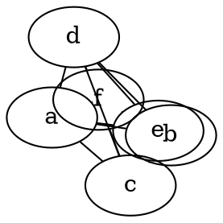

# **Overlap**

The **overlap** attribute controls whether and how **node overlaps** are removed in **force-directed layout**. It helps improve **graph readability** by adjusting node positions to avoid overlap.

------

## **Usage in DOT**

### **Allow Node Overlap (Default in Some Layouts)**



------

## **Usage in Java**

### **Allow Node Overlap (Default in Some Layouts)**

```java
Node a = Node.builder().label("a").build();
Node b = Node.builder().label("b").build();
Node c = Node.builder().label("c").build();

Graphviz graph = Graphviz.graph()
    .layout(Layout.FDP)  // Use FDP layout
    .overlap(true)  // Stronger springs pull nodes closer
    .maxiter(1)
    .addLine(a, b, c)
    .build();
```

