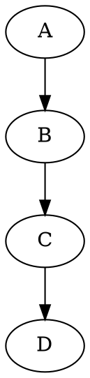
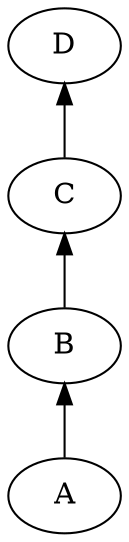
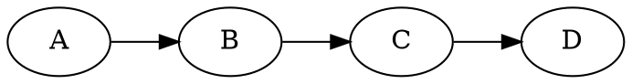
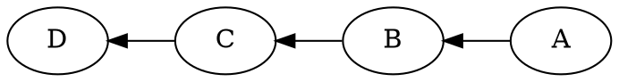

# Rankdir

The **rankdir** attribute controls the **direction of graph layout**, determining how **nodes are arranged** in the rendered output.

------

## **Supported Values and Behavior**

| **Value**      | **Direction**     | **Description**                                         |
| -------------- | ----------------- | ------------------------------------------------------- |
| `TB` (default) | **Top to Bottom** | Nodes are arranged **vertically** from top to bottom.   |
| `BT`           | **Bottom to Top** | Nodes are arranged **vertically** from bottom to top.   |
| `LR`           | **Left to Right** | Nodes are arranged **horizontally** from left to right. |
| `RL`           | **Right to Left** | Nodes are arranged **horizontally** from right to left. |

**Note**: This attribute is **only valid for `DOT` and `DOTQ` layouts** (hierarchical layouts). It is ignored in other layout engines like FDP, JFDP, and GFDP.

------

## **Example Usage in DOT and DOTQ**

```dot
digraph G {
    layout=dotq;     // Use optimized DOT layout
    rankdir=LR;      // Left to Right layout

    A -> B;
    B -> C;
    C -> D;
}
```

### **Explanation**:

- The **`rankdir=LR`** setting **forces a horizontal layout**, making edges **flow from left to right** instead of the default top-to-bottom arrangement.
- Works with both **`layout=dot`** (classic) and **`layout=dotq`** (optimized) layouts.

------

## **Example Usage in Java**

```java
Node a = Node.builder().label("a").build();
Node b = Node.builder().label("b").build();
Node c = Node.builder().label("c").build();
Node d = Node.builder().label("d").build();

// Using DOT layout
Graphviz graphDot = Graphviz.digraph()
    .layout(Layout.DOT)
    .rankdir(Rankdir.LR) // Equivalent to rankdir=LR
    .addLine(Line.builder(a, b).build())
    .addLine(Line.builder(b, c).build())
    .addLine(Line.builder(c, d).build())
    .build();

// Using DOTQ layout
Graphviz graphDotq = Graphviz.digraph()
    .layout(Layout.DOTQ)
    .rankdir(Rankdir.LR) // Equivalent to rankdir=LR
    .addLine(Line.builder(a, b).build())
    .addLine(Line.builder(b, c).build())
    .addLine(Line.builder(c, d).build())
    .build();
```

### **Explanation**:

- **`.rankDir(Rankdir.LEFT_TO_RIGHT)`** → Sets the **graph direction** to **Left to Right (LR)**.
- **Nodes A → B → C → D** will be arranged **horizontally**, just like in the DOT example.
- Works with both **`Layout.DOT`** and **`Layout.DOTQ`** layouts.

------

## **Comparison of Different `rankdir` Values**

### **1️⃣ Top to Bottom (Default)**



🔹 **Nodes are stacked vertically** from **top to bottom**.

------

### **2️⃣ Bottom to Top**



🔹 **Nodes are stacked vertically** but **inverted**, flowing **bottom to top**.

------

### **3️⃣ Left to Right**



🔹 **Nodes are arranged horizontally**, moving **left to right**.

------

### **4️⃣ Right to Left**



🔹 **Nodes are arranged horizontally**, but flow **right to left**.

