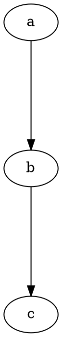
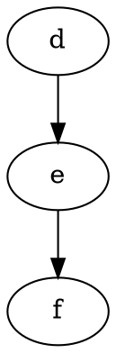
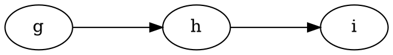

# Ranksep

The **ranksep** attribute controls the **spacing between ranks (levels)** in a directed graph. It determines the **vertical or horizontal distance** between nodes of different ranks.

------

## **Behavior**

- **Applies to directed graphs (`digraph`)**.
- **Controls the distance between adjacent ranks** (levels of nodes).
- **Affects the graph layout but does not change the rank assignment itself**.
- **Accepts a single value (uniform spacing) or two values (`equally spaced`, `non-equally spaced`)**.
- **Default value is `0.5` (graph engine-dependent default)**.

------

## **Usage in DOT**

### **Increase Vertical Spacing**



### **Default Spacing**



### **Different Horizontal and Vertical Spacing**



------

## **Usage in Java**

### **Increase Vertical Spacing**

```java
Node a = Node.builder().label("a").build();
Node b = Node.builder().label("b").build();
Node c = Node.builder().label("c").build();

Graphviz graph = Graphviz.digraph()
    .rankSep(1.5)  // Increases spacing between ranks
    .addLine(a, b)
    .addLine(b, c)
    .build();
```

### **Default Spacing**

```java
Node d = Node.builder().label("d").build();
Node e = Node.builder().label("e").build();
Node f = Node.builder().label("f").build();

Graphviz graph = Graphviz.digraph()
    .rankSep(0.5)  // Default behavior (engine-dependent default)
    .addLine(d, e)
    .addLine(e, f)
    .build();
```

### **Different Horizontal and Vertical Spacing**

```java
Node g = Node.builder().label("g").build();
Node h = Node.builder().label("h").build();
Node i = Node.builder().label("i").build();

Graphviz graph = Graphviz.digraph()
    .rankdir(Rankdir.LR)  // Left to Right layout
    .rankSep(1.0)  // Ensures uniform spacing between ranks
    .addLine(g, h)
    .addLine(h, i)
    .build();
```