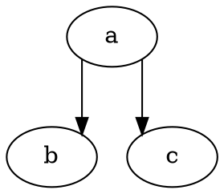

# Showgrid

The **showgrid** attribute controls the **visibility of the grid used in the orthogonal spline routing algorithm**. This grid helps in edge routing by aligning edges to a structured orthogonal layout.

------

## **Usage in DOT**

### **Enable Grid Display**



------

## **Usage in Java**

### **Enable Grid Display**

```java
Node a = Node.builder().label("a").build();
Node b = Node.builder().label("b").build();
Node c = Node.builder().label("c").build();

Graphviz graph = Graphviz.digraph()
    .splines(Splines.ORTHO)
    .showGrid(true)  // Enables grid for orthogonal edge routing
    .addLine(a, b)
    .addLine(a, c)
    .build();
```