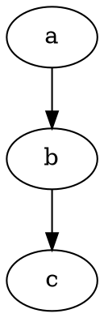

# Size

The **size** attribute controls the **overall bounding box size** of the graph layout. It limits the **width and height** of the rendered graph.

## **Usage in DOT**

### **Limit Graph to 5×3 Inches**



------

## **Usage in Java**

```java
Node a = Node.builder().label("a").build();
Node b = Node.builder().label("b").build();
Node c = Node.builder().label("c").build();

Graphviz graph = Graphviz.digraph()
    .scale(5, 3)  // Sets maximum width to 5 inches and height to 3 inches
    .addLine(a, b)
    .addLine(b, c)
    .build();
```

