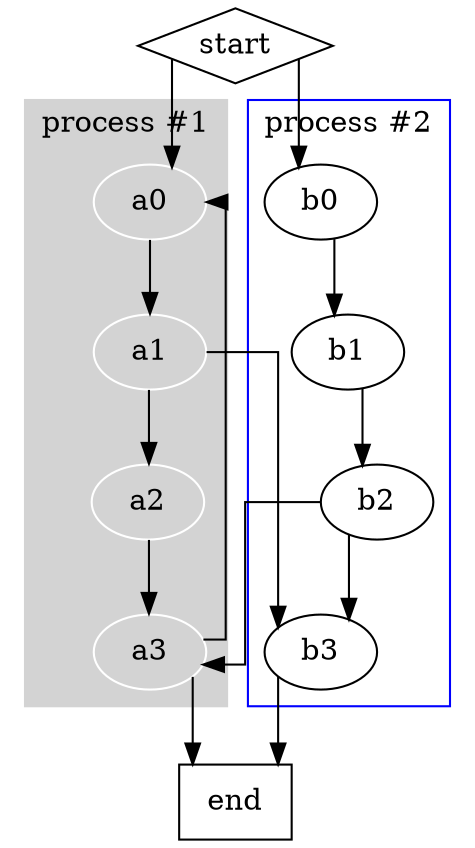

# Splines

The **splines** attribute controls how **edges are routed and drawn** between nodes in a graph. Different spline styles affect **edge appearance**, **curvature**, and **obstacle avoidance**.

------

## **Supported Values and Behavior**

| **Value**  | **Effect**               | **Description**                                              |
| ---------- | ------------------------ | ------------------------------------------------------------ |
| `none`     | **No edges are drawn**   | Lines are completely hidden.                                 |
| `rounded`  | **Smooth rounded edges** | Routes edges around obstacles using boxes and smooths the corners between segments. The **`radian`** attribute can adjust corner smoothness. |
| `spline`   | **Curved edges**         | Routes edges through control points using a smooth curve.    |
| `line`     | **Straight lines**       | Directly connects nodes with a single straight segment.      |
| `polyline` | **Segmented routing**    | Uses multiple straight-line segments to avoid obstacles.     |
| `ortho`    | **Right-angle edges**    | Forces edges to be drawn using only horizontal and vertical segments. |

------

## **Usage in DOT**



------

## **Usage in Java**

```java
Graphviz graph = Graphviz.digraph()
    .splines(Splines.ORTHO)  // Uses smooth cornered edges
    .addLine(Line.builder(Node.builder().id("a").build(), Node.builder().id("b").build())
                 .label("Sharper Bend")
                 .radian(0.2)  // Less smooth corner
                 .build())
    .addLine(Line.builder(Node.builder().id("a").build(), Node.builder().id("c").build())
                 .label("Smoother Curve")
                 .radian(15)  // More rounded corner
                 .build())
    .build();

```

