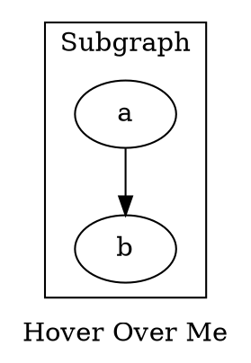

# **Tooltip**

The **tooltip** attribute defines **hover text** for the entire graph, but it only works when the graph has an **href (clickable link)** and is rendered in **SVG format**.

------

## **Examples**

### **DOT Syntax**



------

### **Java Usage**

```java
Node a = Node.builder().label("a").build();

Graphviz graph = Graphviz.digraph()
    .href("https://example.com") // Tooltip requires href
    .tooltip("This is a graph tooltip") // Set hover text
    .label("Hover Over Me")
    .addNode(a)
    .build();
```