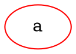

# Color

Specifies the border color of the node. The node color can be used to highlight or distinguish nodes from one another.

**Usage**:

Dot



Java

```dot
Node node = Node.builder()
    .color(Color.RED)
    .build();
```

Color detail see [Color Intro](../Color Intro)