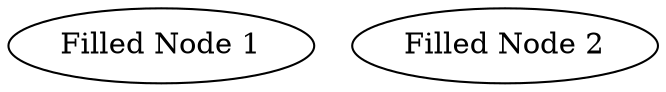

# **Fill Color**

**Fill color** controls the background color of a node. The `fillcolor` attribute has an alias, `bgcolor`, so `a[fillcolor=red]` is equivalent to `b[bgcolor=red]`.

### **Example:**

#### DOT Example



#### Java Example

```java
Node node1 = Node.builder()
    .label("Filled Node 1")
    .fillColor(Color.YELLOW)  // Fill with yellow
    .build();
```

Color detail see [Color Intro](../Color Intro)