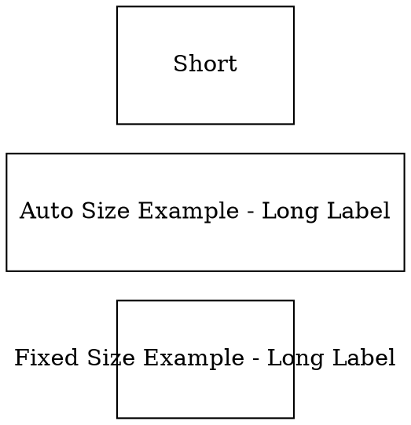

# FixedSize

The **fixedsize** attribute controls whether a node's **width and height are strictly enforced** or if the node size can adjust dynamically based on the label content.

- **`fixedsize=false` (default)** → The node will **at least** use the defined `width` and `height`, but it can expand automatically if the label is too large.
- **`fixedsize=true`** → The node will **always** have the specified `width` and `height`, regardless of the label size.

## Examples:

Dot



- **`fixedsize=true`** → The node **always** maintains `width=1.5` and `height=1.0`, even if the label overflows.
- **`fixedsize=false`** → The node **at least** has `width=1.5` and `height=1.0`, but it **expands** if the label needs more space.

Java

```java
// Fixed size: Node will always be 1.5 x 1.0, even if label is larger
Node fixedSizeNode = Node.builder()
    .label("Fixed Size Example - Long Label")
    .shape(NodeShapeEnum.BOX)
    .width(1.5)
    .height(1.0)
    .fixedSize(true) // Node size is strictly 1.5 x 1.0
    .build();

// Auto size: Node will be at least 1.5 x 1.0, but can grow if needed
Node autoSizeNode = Node.builder()
    .label("Auto Size Example - Long Label")
    .shape(NodeShapeEnum.BOX)
    .width(1.5)
    .height(1.0)
    .fixedSize(false) // Node can expand beyond 1.5 x 1.0 if needed
    .build();

// Auto size with small label: Will stay at 1.5 x 1.0 since label is small
Node smallLabelNode = Node.builder()
    .label("Short")
    .shape(NodeShapeEnum.BOX)
    .width(1.5)
    .height(1.0)
    .fixedSize(false) // Node will remain 1.5 x 1.0 unless label exceeds that size
    .build();
```

- **`fixedSize(true)`** → Node **always** stays at `width` and `height`, even if the label is larger.
- **`fixedSize(false)`** → Node will **use** `width` and `height` as a minimum, but **expand** if the label is larger.