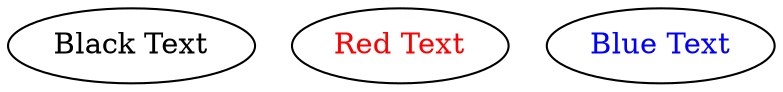

### **Font Color**

The **font color** controls the color of the text inside a node.

------

## Examples

Dot



Java

```java
Node node1 = Node.builder()
    .label("Black Text")
    .fontColor(Color.BLACK) // Set text color to black
    .build();

Node node2 = Node.builder()
    .label("Red Text")
    .fontColor(Color.RED) // Set text color to red
    .build();

Node node3 = Node.builder()
    .label("Blue Text")
    .fontColor(Color.BLUE)  // Set text color to blue
    .build();
```