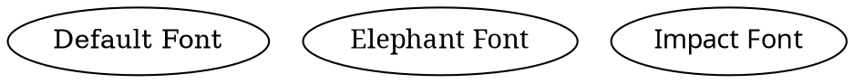

# Font Name

The **font name** controls the typeface used for text inside a node. 

## Examples:

Dot



Java

```java
Node node1 = Node.builder()
    .label("Default Font") 
    .build();

Node node2 = Node.builder()
    .label("Elephant Font")
    .fontName("Elephant") 
    .build();

Node node3 = Node.builder()
    .label("Impact Font")
    .fontName("Impact")
    .fontColor(Color.BLUE) 
    .build();
```