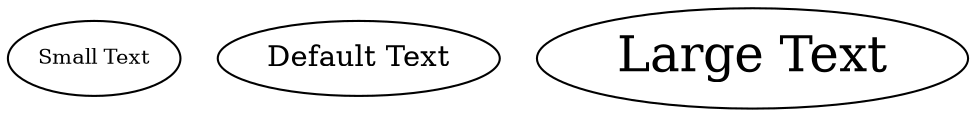

# FontSize 

The **fontsize** attribute sets the **size of the text inside a node**. Larger values make the text bigger, while smaller values make it smaller.

## Examples:

Dot



- **`fontsize=10`** → Small text size.
- **No `fontsize` specified** → Uses the default size (typically `14`).
- **`fontsize=24`** → Large text size.

Java

```java
Node smallText = Node.builder()
    .label("Small Text")
    .fontSize(10) // Set font size to 10
    .build();

Node defaultText = Node.builder()
    .label("Default Text") // Uses default font size (typically 14)
    .build();

Node largeText = Node.builder()
    .label("Large Text")
    .fontSize(24) // Set font size to 24
    .build();
```

- **`fontSize(int size)`** → Sets the text size in points (pt).
- **If `fontSize` is not set, the default is used (typically 14pt).**