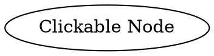

# Href

The **href** attribute (alias: **url**) adds a **clickable hyperlink** to a node, making it interactive in `SVG` outputs.

## Examples:

Dot



- **`href="URL"`** → Clicking the node **opens the link** in `SVG` exports.
- **Works in `svg` formats** but not in plain images (`png`, `jpg` etc).

Java

```java
Node clickableNode = Node.builder()
    .label("Clickable Node")
    .href("https://example.com") // Set hyperlink
    .build();
```

- **`href(String url)`** → Adds a hyperlink to the node.
- **Works in `svg` formats** but not in plain images (`png`, `jpg` etc).