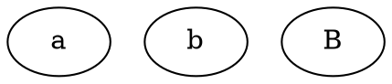

## ID

Sets a unique identifier for the node. If not specified, it is automatically assigned during rendering.
**Note**: If multiple nodes share the same ID, only one will be rendered.

**Usage**:

Java
```java
Node A = Node.builder().id("node_a").build();
// If two nodes id are same, only one node can be rendered.
Node a = Node.builder().id("node_A").build();
```

Dot
