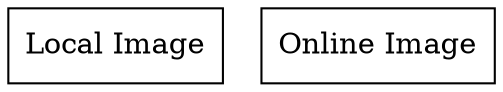

## Image

The **image** attribute allows setting an **image** as the node’s content. The image can be **a local file** (using the `file://` format) or **a URL** (`http://` or `https://`).

See here check [Image Security Warning](../Image Security Warning.md)

## Examples:

Dot



- **`image="file:///absolute/path/to/image.png"`** → Uses a **local image file** with an absolute file path.
- **`image="https://example.com/image.png"`** → Loads an **image from a URL**.
- **`shape=box`** (or another non-record shape) is required for images to be displayed properly.

Java

```java
Node localImageNode = Node.builder()
    .label("Local Image")
    .shape(NodeShapeEnum.BOX) // Required for proper image rendering
    .image("file:///absolute/path/to/image.png") // Local file with file:// format
    .build();

Node urlImageNode = Node.builder()
    .label("URL Image")
    .shape(NodeShapeEnum.BOX) // Required for proper image rendering
    .image("https://example.com/image.png") // Image from URL
    .build();

Graphviz graph = Graphviz.digraph()
    .addNode(localImageNode, urlImageNode)
    .build();
```

- **`image("file:///absolute/path/to/image.png")`** → Loads an image from a **local file** using `file://`.
- **`image("https://example.com/image.png")`** → Loads an image from **an online source**.
- **Requires `shape=box` (or similar) to display properly.**