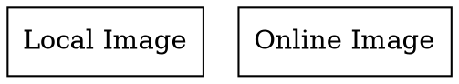

## Image

The **image** attribute allows setting an **image** as the node’s content. Embedded base64 raster
images work by default. Local files and remote URLs require an explicit security policy.

See here check [Image Security Warning](../Image Security Warning.md)

## Examples:

Dot


```dot
digraph G {
    a [label="Local Image", shape=box, image="file:///absolute/path/to/image.png"];
    b [label="Online Image", shape=box, image="https://upload.wikimedia.org/wikipedia/commons/6/6a/JavaScript-logo.png"];
}
```

- **`image="file:///absolute/path/to/image.png"`** → Uses a **local image file** with an absolute file path.
- **`image="https://example.com/image.png"`** → Loads an **image from a URL**.
- **`shape=box`** (or another non-record shape) is required for images to be displayed properly.

Java

```java
Node localImageNode = Node.builder()
    .label("Local Image")
    .shape(NodeShapeEnum.BOX) // Required for proper image rendering
    .image("file:///absolute/path/to/image.png") // Local file with file:// format
    .build();

Node urlImageNode = Node.builder()
    .label("URL Image")
    .shape(NodeShapeEnum.BOX) // Required for proper image rendering
    .image("https://example.com/image.png") // Image from URL
    .build();

Graphviz graph = Graphviz.digraph()
    .securityPolicy(SecurityPolicy.builder()
        .allowRemoteImages(true)
        .allowRemoteImageHost("upload.wikimedia.org")
        .localImageBaseDirectory(Paths.get("/absolute/path/to"))
        .build())
    .addNode(localImageNode, urlImageNode)
    .build();
```

- **`image("file:///absolute/path/to/image.png")`** → Loads the file only when it resolves under
  the configured local image base directory.
- **`image("https://example.com/image.png")`** → Loads the URL only when remote images are enabled;
  private, loopback, link-local, and multicast addresses are blocked by raster converters.
- **Requires `shape=box` (or similar) to display properly.**
