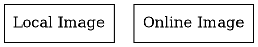

## Image

The **image** attribute allows setting an **image** as the node’s content. Embedded base64 raster
images work by default. Local files and remote URLs require an explicit security policy.

See here check [Image Security Warning](../Image Security Warning.md)

## Examples:

Dot


```dot
digraph G {
    a [label="Local Image", shape=box, image="file:///absolute/path/to/image.png"];
    b [label="Online Image", shape=box, image="https://upload.wikimedia.org/wikipedia/commons/6/6a/JavaScript-logo.png"];
}
```

- **`image="file:///absolute/path/to/image.png"`** → Uses a **local image file** with an absolute file path.
- **`image="https://upload.wikimedia.org/..."`** → Loads an **image from a URL**. The host must be
  allow-listed by the security policy, so the example below allow-lists `upload.wikimedia.org`.
- **`shape=box`** (or another non-record shape) is required for images to be displayed properly.

Java

```java
Node localImageNode = Node.builder()
    .label("Local Image")
    .shape(NodeShapeEnum.BOX) // Required for proper image rendering
    .image("file:///absolute/path/to/image.png") // Local file with file:// format
    .build();

Node urlImageNode = Node.builder()
    .label("URL Image")
    .shape(NodeShapeEnum.BOX) // Required for proper image rendering
    // Image from URL; the host must be allow-listed below
    .image("https://upload.wikimedia.org/wikipedia/commons/6/6a/JavaScript-logo.png")
    .build();

Graphviz graph = Graphviz.digraph()
    .securityPolicy(SecurityPolicy.builder()
        .allowRemoteImages(true)
        .allowRemoteImageHost("upload.wikimedia.org")
        .localImageBaseDirectory(Paths.get("/absolute/path/to"))
        .build())
    .addNode(localImageNode, urlImageNode)
    .build();
```

- **`image("file:///absolute/path/to/image.png")`** → Loads the file only when it resolves under
  the configured local image base directory.
- **`image("https://upload.wikimedia.org/...")`** → Loads the URL only when remote images are
  enabled **and** the exact host is allow-listed. Allow-list entries are matched exactly:
  `upload.wikimedia.org` does not authorize `cdn.upload.wikimedia.org` or
  `upload.wikimedia.org.example.net`.
- **Requires `shape=box` (or similar) to display properly.**

### What the address restrictions cover

When graph-support fetches the image itself, either through the built-in raster converter or
through SVG preparation for Batik/FOP conversion (including raw SVG conversion), it
resolves the allow-listed hostname, refuses the reference unless **every** resolved address is
public, and then connects to one of exactly those addresses. Any answer containing a loopback,
any-local, link-local, site-local, IPv6 unique-local, carrier-grade-NAT or multicast address
rejects the whole reference - including an IPv6 address that embeds such an IPv4 destination - and
the address that was checked is the address the socket is connected to. Redirects are not followed
and only an HTTP `200` with a decodable raster content type is accepted. HTTPS keeps the hostname
for the `Host` header, for SNI and for certificate verification.

**SVG output** is not covered: it embeds the approved URL as an `xlink:href`. Nothing is fetched by
graph-support, so whichever viewer or browser renders that SVG performs its own request under its
own rules.

**Batik / FOP conversion**, including `TIFF`, `PDF`, and raw SVG-to-PNG, first loads approved images
through the shared policy-controlled loader and replaces their references with canonical raster
data URIs. Local and remote opt-in therefore work without giving Batik any external image URL.
Only reader-validated single-frame PNG, JPEG, GIF, and BMP images are accepted on this path; data
URI MIME declarations must match the actual format. Per-image policy limits and fixed aggregate
image budgets apply. Batik must accept both external-resource and script disabling hints; missing
or rejected protections fail closed rather than continuing with a warning.

See [SVG Conversion Security](../SVG%20Conversion%20Security.md) for the pre-DOM XML limits, exact
project-doctype exception, prohibited instancing/gradient reference chains, and aggregate loaded,
encoded, and decoded image budgets. These limits are not a general safety guarantee for arbitrary
untrusted SVG complexity.
