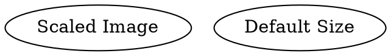

# ImageSize

The **imageWidth** and **imageHeight** attributes control the **display size** of an image inside a node. These attributes are only effective when an **image is set** using the `image` attribute.

## Examples:

Dot



- **`imageWidth=0.5`** → Sets the image width relative to the node size.
- **`imageHeight=3`** → Sets the image height relative to the node size.
- **If `imageWidth` or `imageHeight` is not set**, the image scales automatically based on its original size.

Java

```java
Node scaledImageNode = Node.builder()
    .label("Scaled Image")
    .image("https://upload.wikimedia.org/wikipedia/commons/6/6a/JavaScript-logo.png")
    .imageSize(0.5, 3.0)
    .build();

Node defaultImageNode = Node.builder()
    .label("Default Size")
    .image("https://upload.wikimedia.org/wikipedia/commons/6/6a/JavaScript-logo.png")
    .build();
```

- **`imageWidth(double width)`** → Defines the **relative width** of the image inside the node.
- **`imageHeight(double height)`** → Defines the **relative height** of the image inside the node.
- **If `imageWidth` or `imageHeight` is not specified**, the image keeps its default size **relative to the node size**.

