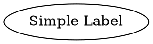
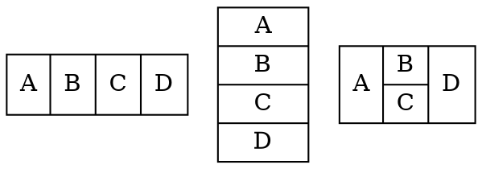
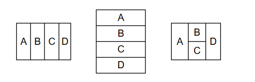
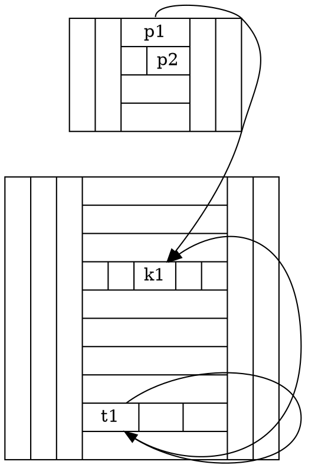
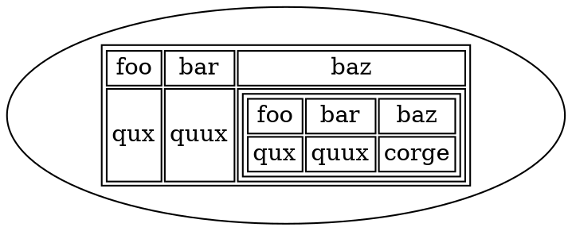

# Label

Defines the node's text content. Labels can be simple strings or **Cell Expressions** for complex layouts.

* **Simple Label**
  * A basic string text displayed within the node. This is the simplest way to set a node's label.

- **Cell Expressions** 
  - Allows horizontal and vertical layouts of fields within a node.
- **[Label Tag](../LabelTag)**
  - Allows the use of HTML-like tags for rich text formatting, enabling styles like bold, italics,
- **[Table Tag](../Table)**
  - Allows the use of an HTML-like table structure for arranging content in rows and columns.

## Using a Simple Label

Java

```java
Node node = Node.builder().label("Simple Label").build();
```

Dot



## Using Cell Expression

`Cell Expression` is used when the shape of a node is specified as `NodeShapeEnum.RECORD` or `NodeShapeEnum.M_RECORD`. The structure of a record-based node is determined by its label, which follows this schema:

- **rlabel** = `field` ( '|' `field` )*
- **field** = `fieldId` or '{' `rlabel` '}'
- **fieldId** = `[ '<' string '>' ] [ string ]`

### Special Characters

Braces (`{}`), vertical bars (`|`), and angle brackets (`<>`) must be escaped with a backslash (`\`) if you want them to appear as literal characters.  
Spaces are interpreted as separators between tokens, so they must also be escaped if you want spaces in the text.

### Layout Orientation

- Flipping between horizontal and vertical layouts is done by nesting fields in braces `{...}`.  
- The top-level orientation in a record is horizontal. 

### Special Case: `<fieldId>`

- When a field is enclosed in angle brackets (e.g., `<c1>`), it represents a **port** for that field. This allows you to create edges directed to a specific part of the node (i.e., the field `c1`).

### Examples:

Dot



Java

```java
Node n1 = Node.builder().label("A | B | C | D").build();
Node n2 = Node.builder().label("{A | B | C | D}").build();
Node n3 = Node.builder().label("A | { B | C } | D").build();

Graphviz.digraph()
    .tempNode(Node.builder().shape(NodeShapeEnum.RECORD).build())
    .addNode(n1, n2, n3)
    .build();
```



### Cell fieldId examples:

Dot



Java

```java
Node a = Node.builder().label("||{<p1>p1|{|<p2>p2}||}||").build();
Node b = Node.builder().label("|||{|||{||<k1>k1||}|||||{<t1>t1||}|}||").build();

Graphviz graphviz = Graphviz.digraph()
    .tempNode(Node.builder().shape(NodeShapeEnum.RECORD).build())
    .addLine(Line.builder(a, b).tailCell("p1").headCell("k1").build()) 
    .addLine(Line.builder(b, b).tailCell("t1").headCell("t1").build()) 
    .addLine(Line.builder(b, b).tailCell("t1").headCell("k1").build()) 
    .build();
```

## Using Label tag

Detail please check [Label Tag](../LabelTag)

### Examples:

Dot

```dot
digraph {
    n1 [label=< 
        Line 1<BR/>Line 2<BR/>Line 3<BR/>
        <FONT POINT-SIZE="16" COLOR="blue" FACE="Arial">Styled Text</FONT><BR/>
        <B>Bold</B> <I>Italic</I> <U>Underline</U><BR/>
        H<SUB>2</SUB>O + CO<SUB>2</SUB><BR/>
        <S><FONT COLOR="red">Strikethrough and Colored</FONT></S><BR/>
        <HR><FONT COLOR="green">Right Aligned</FONT></HR><BR/>
        <HL>Left Aligned</HL><BR/>
        <HC>Centered Text</HC><BR/>
        <O>Overlined Text</O><BR/>
        <FONT POINT-SIZE="12" COLOR="purple" FACE="Impact">Impact Font</FONT><BR/>
        <B><I><U><S>Complex Formatting</S></U></I></B><BR/>
        <SUP>Superscript Text</SUP> and <SUB>Subscript Text</SUB><BR/>
        <VT>Top-Aligned</VT>
        <FONT POINT-SIZE=40>NEXT</FONT><BR/>
        <VB>Bottom-Aligned Text</VB>
        <FONT POINT-SIZE=40>NEXT</FONT><BR/>
        <VC>Vertically Centered Text</VC>
        <FONT POINT-SIZE=40>NEXT</FONT><BR/>
    >];
}
```

Java api using another attribute `labelTag` like:

```java
 LabelTag label = text("Line 1").br()
        .text("Line 2").br()
        .text("Line 3").br()
        .font("Styled Text", fontAttrs().pointSize(16).color(Color.BLUE).face("Arial")).br()
        .bold("Bold ").italic("Italic ").underline("Underline").br()
        .text("H").subscript("2").text("O + CO").subscript("2").br()
        .strikeThrough(font("Strikethrough and Colored", fontAttrs().color(Color.RED)))
        .br()
        .right(font("Right Aligned", fontAttrs().color(Color.GREEN))).br()
        .left("Left Aligned").br()
        .horizontalCenter("Centered Text").br()
        .overline("Overlined Text").br()
        .font("Impact Font", fontAttrs().pointSize(12).color(Color.PURPLE).face("Impact")).br()
        .bold(italic(underline(strikeThrough("Complex Formatting")))).br()  // Correct order for Complex Formatting
        .superscript("Superscript Text").text(" and ").subscript("Subscript Text").br()
        .top("Top-Aligned").font("NEXT", fontAttrs().pointSize(40)).br()
        .bottom("Bottom-Aligned Text").font("NEXT", fontAttrs().pointSize(40)).br()
        .verticalCenter("Vertically Centered Text").font("NEXT", fontAttrs().pointSize(40));

Node.builder().labelTag(label).build();
```

## Using Table tag

Detail please check [Table Tag](../Table)

### Examples:

Dot



Java api using another attribute `table` like

```java
Node node = Node.builder()
    .table(
        table()
            .tr(
                td().text("foo"),
                td().text("bar"),
                td().text("baz")
            )
            .tr(
                td().text("qux"),
                td().text("quux"),
                td()
                    .table(
                        table()
                            .tr(
                                td().text("foo"),
                                td().text("bar"),
                                td().text("baz")
                            )
                            .tr(
                                td().text("qux"),
                                td().text("quux"),
                                td().text("corge")
                            )
                    )
            )
    )
    .build();
```


