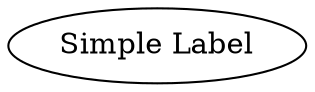
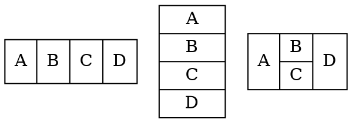

# Label

Defines the node's text content. Labels can be simple strings or **Cell Expressions** for complex layouts.

* **Simple Label**
  * A basic string text displayed within the node. This is the simplest way to set a node's label.

- **Cell Expressions** 
  - Allows horizontal and vertical layouts of fields within a node.
- **Label Tag** 
  - Allows the use of HTML-like tags for rich text formatting, enabling styles like bold, italics,
- **Table Tag** 
  - Allows the use of an HTML-like table structure for arranging content in rows and columns.

## Using a Simple Label

Java

```java
Node node = Node.builder().label("Simple Label").build();
```

Dot



## Using Cell Expression

`Cell Expression` is used when the shape of a node is specified as `NodeShapeEnum.RECORD` or `NodeShapeEnum.M_RECORD`. The structure of a record-based node is determined by its label, which follows this schema:

- **rlabel** = `field` ( '|' `field` )*
- **field** = `fieldId` or '{' `rlabel` '}'
- **fieldId** = `[ '<' string '>' ] [ string ]`

### Special Characters

Braces (`{}`), vertical bars (`|`), and angle brackets (`<>`) must be escaped with a backslash (`\`) if you want them to appear as literal characters.  
Spaces are interpreted as separators between tokens, so they must also be escaped if you want spaces in the text.

### Layout Orientation

- Flipping between horizontal and vertical layouts is done by nesting fields in braces `{...}`.  
- The top-level orientation in a record is horizontal.  

### Examples:

Java

```java
// A record with the label "A | B | C | D" will have 4 fields oriented left to right.
Node n1 = Node.builder().label("A | B | C | D").build();
// A record with the label "{A | B | C | D}" will have the fields oriented top to bottom.
Node n2 = Node.builder().label("{A | B | C | D}").build();
// A record with the label "A | { B | C } | D" will have B over C, with A to the left and D to the right of B and C.
Node n3 = Node.builder().label("A | { B | C } | D").build();

Graphviz.digraph()
    .tempNode(Node.builder().shape(NodeShapeEnum.RECORD).build())
    .addNode(n1, n2, n3)
    .build();
```

Dot



