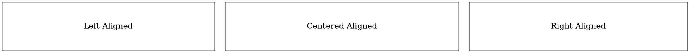

# LabelJust (Label Justification)

The **labeljust** attribute controls the **horizontal alignment of the label relative to the node container**. By default, the label is **centered** within the node.

## Examples:

Dot



- **`labeljust=l`** → Aligns text to the **left**.
- **`labeljust=c`** → Centers the text (**default**).
- **`labeljust=r`** → Aligns text to the **right**.

Java

```java
Node leftAligned = Node.builder()
    .label("Left Aligned")
    .shape(NodeShapeEnum.BOX)
    .labeljust(Labeljust.LEFT) // Align text to the left
    .margin(2, 0.5)
    .build();

Node centered = Node.builder()
    .label("Centered Aligned")
    .shape(NodeShapeEnum.BOX)
    .labeljust(Labeljust.CENTER) // Centered text (default)
    .margin(2, 0.5)
    .build();

Node rightAligned = Node.builder()
    .label("Right Aligned")
    .shape(NodeShapeEnum.BOX)
    .labeljust(Labeljust.RIGHT) // Align text to the right
    .margin(2, 0.5)
    .build();
```

- **`labelJust(LabelJust.LEFT)`** → Left-aligns text.
- **`labelJust(LabelJust.CENTER)`** → Centers text (default).
- **`labelJust(LabelJust.RIGHT)`** → Right-aligns text.