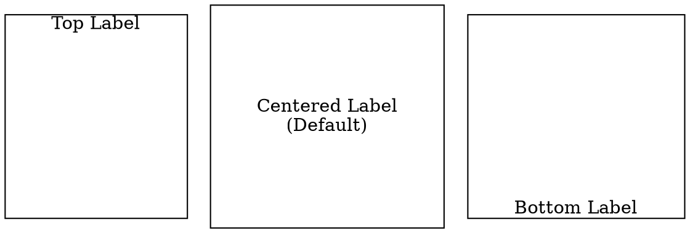

# LabelLoc (Label Vertical Alignment)

The **labelloc** attribute controls the **vertical alignment** of a node’s label within the node container. By default, the label is positioned **in the center** of the node.

## Examples:

Dot



- **`labelloc=t`** → Positions the label at the **top** of the node.
- **`labelloc=c`** → Centers the label (**default**).
- **`labelloc=b`** → Positions the label at the **bottom** of the node.

Java

```java
Node topLabel = Node.builder()
    .label("Top Label")
    .shape(NodeShapeEnum.BOX)
    .labelloc(Labelloc.TOP) // Align label to the top
    .margin(0.5, 1)
    .build();

Node centerLabel = Node.builder()
    .label("Centered Label\n(Default)")
    .shape(NodeShapeEnum.BOX)
    .labelloc(Labelloc.CENTER) // Default: Centered label
    .margin(0.5, 1)
    .build();

Node bottomLabel = Node.builder()
    .label("Bottom Label")
    .shape(NodeShapeEnum.BOX)
    .labelloc(Labelloc.BOTTOM) // Align label to the bottom
    .margin(0.5, 1)
    .build();
```

- **`labelLoc(LabelLoc.TOP)`** → Aligns the label to the **top**.
- **`labelLoc(LabelLoc.CENTER)`** → Keeps the label **centered** (**default**).
- **`labelLoc(LabelLoc.BOTTOM)`** → Aligns the label to the **bottom**.