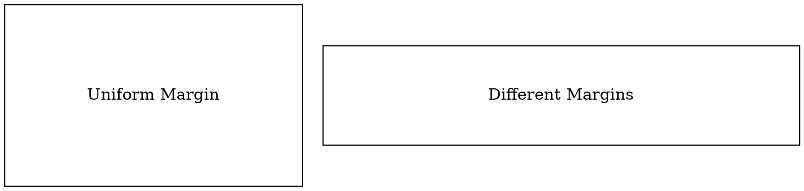

# Node Margin

The **margin** attribute defines the **horizontal and vertical padding** inside a node, controlling the space between the label and the node boundary. It supports **two values**:

- **`margin="width, height"`** → Sets different padding for width and height.
- **`margin="value"`** → Sets uniform padding for both width and height.

## Examples:

Dot



- **`margin=1`** → Both width and height have a margin of `1`.
- **`margin="2,0.5"`** → `2` for width (horizontal padding), `0.5` for height (vertical padding).

Java

```java
Node uniformMargin = Node.builder()
    .label("Uniform Margin")
    .shape(NodeShapeEnum.BOX)
    .margin(1) // Same margin for width and height
    .build();

Node differentMargins = Node.builder()
    .label("Different Margins")
    .shape(NodeShapeEnum.BOX)
    .margin(2.0, 0.5) // 2.0 for width, 0.5 for height
    .build();
```

- **`margin(double value)`** → Sets uniform padding for width and height.
- **`margin(double width, double height)`** → Sets **different** padding for width and height.