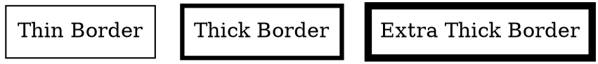

# PenWidth

The **penwidth** attribute controls the **thickness of the node's border**. A higher value makes the border **thicker**, while a lower value makes it **thinner**.

## Examples:

Dot



- **`penwidth=1`** → Default border thickness.
- **`penwidth=3`** → Thicker border for emphasis.
- **`penwidth=5`** → Extra thick border for highlighting important nodes.

Java

```java
Node thinBorder = Node.builder()
    .label("Thin Border")
    .shape(NodeShapeEnum.BOX)
    .penWidth(1) // Default thickness
    .build();

Node thickBorder = Node.builder()
    .label("Thick Border")
    .shape(NodeShapeEnum.BOX)
    .penWidth(3) // Thicker border
    .build();

Node extraThickBorder = Node.builder()
    .label("Extra Thick Border")
    .shape(NodeShapeEnum.BOX)
    .penWidth(5) // Very thick border
    .build();
```

- **`penWidth(double width)`** → Sets the border thickness of the node.
- **Larger values create bolder borders, improving visibility.**

