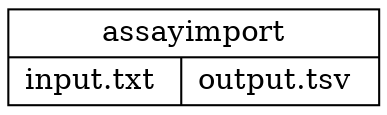
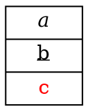

# RecordTag — structured record labels

`RecordTag` is the Java API for building record labels. It replaces hand-assembling the
[frozen string grammar](Label.md#using-cell-expression) and is the only way to put formatted text
inside a record cell.

Applies to nodes whose shape is `NodeShapeEnum.RECORD` or `NodeShapeEnum.M_RECORD`. When both
`label` and `recordTag` are set, `recordTag` wins.

## Building a record

```java
import static org.graphper.api.Html.*;

Node n = Node.builder()
    .shape(NodeShapeEnum.RECORD)
    .recordTag(record(
        cell("a").id("f0"),
        vertical(cell("b"), cell("c")),
        cell("d").id("f1")))
    .build();
```

That is the equivalent of `label("<f0>a|{b|c}|<f1>d")`. Factory methods:

| Method | Meaning |
|---|---|
| `record(cells...)` | root laid out left to right |
| `verticalRecord(cells...)` | root laid out top to bottom |
| `cell(String)` | plain text cell |
| `cell(LabelTag)` | rich text cell |
| `cell()` | blank cell, to be filled fluently |
| `vertical(cells...)` | nested cell whose children stack downwards |
| `horizontal(cells...)` | nested cell whose children run rightwards |

`cell().id("f0")` attaches a port, so a line can target that cell with
[`tailCell`](../edge/TailCell.md) / [`headCell`](../edge/HeadCell.md).

## Rich text cells

Any [`LabelTag`](../LabelTag.md) can be a cell body, which the string grammar cannot express:

```java
Node table = Node.builder()
    .shape(NodeShapeEnum.RECORD)
    .recordTag(verticalRecord(
        horizontal(cell(bold("Name")), cell(bold("Sex")), cell(bold("Age"))),
        horizontal(cell("Michael"), cell("Men"), cell("15")),
        horizontal(cell("Abigail"), cell(italic("Female")), cell("18"))))
    .build();
```

Fragments may be mixed within one cell:

```java
cell(labelTag().text("plain ").bold("B").text(" ").italic("I"))
```

Node level attributes (`fontName`, `fontSize`, `fontColor`, `fontStyle`) supply the defaults; tags
inside a cell refine them, so `font("x", fontAttrs().color(Color.RED))` recolours only that fragment.

## Text alignment and line breaks

Record cells support line-by-line horizontal alignment, with syntax appropriate to each input
form.

### Quoted record labels in DOT

Plain quoted record labels use Graphviz line terminators:

| Escape | Result |
|---|---|
| `\n` | end the line and center it in the cell |
| `\l` / `\L` | end the line and align it to the cell's left side |
| `\r` / `\R` | end the line and align it to the cell's right side |



The line position is calculated from the containing cell boundary, not the overall SVG canvas.
These terminators remain part of the compatibility string grammar even though new structural
features are frozen.

### Rich record labels in DOT

Angle-bracket labels use HTML-like alignment tags and `<BR/>` line breaks:

```dot
digraph G {
  task [shape=record,
        label=<{<B>assayimport</B>|<HL>input.txt</HL><BR/><HR>output.tsv</HR>}>]
}
```

Use `<HL>` for left, `<HC>` for center, and `<HR>` for right alignment. These tags can be combined
with fonts and inline styles inside the same rich cell. Keep source-formatting whitespace out of a
rich cell when it is not intended as visible text.

### Java RecordTag

A rich Java cell uses the corresponding `LabelTag` methods:

```java
LabelTag files = labelTag()
    .left("input.txt").br()
    .right("output.tsv");

Node task = Node.builder()
    .shape(NodeShapeEnum.RECORD)
    .recordTag(record(
        cell(bold("assayimport")),
        cell(files)))
    .build();
```

`left(...)`, `horizontalCenter(...)`, and `right(...)` control horizontal alignment; `br()` starts
the next line.

## In DOT source

A record-shaped node with an angle-bracket label gets its structure recovered, matching Graphviz:



Two limitations, both shared with Graphviz:

- **Port ids are not available in this form.** `<f0>` inside `<...>` is lexed as an HTML tag and
  fails the parse. Ports combined with rich text are reachable only from Java:
  `cell(italic("a")).id("f0")`.
- **Only record shapes reinterpret `{`, `|` and `}`.** On any other shape they stay literal text,
  which is the existing behaviour.

A quoted label (`label="{a|b|c}"`) continues to go through the frozen string grammar. Its
Graphviz-compatible `\n`, `\l`, and `\r` line terminators are supported as described above.
