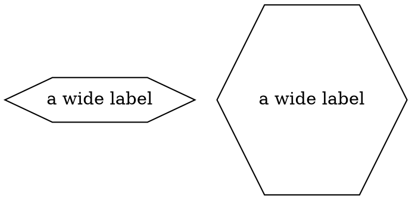

# Regular

The `regular` node attribute controls whether polygon-based shapes are forced to use equal width
and height. The default is `false`, matching Graphviz.

## DOT



The first hexagon expands mainly in the horizontal direction. The second is expanded to a square
container after its content and minimum width/height requirements have been calculated.

Only case-insensitive `true` and `false` are accepted. Invalid values such as `regular=true1` are
ignored and therefore use the default `false` behavior.

## Java

```java
Node regularHexagon = Node.builder()
    .shape(NodeShapeEnum.HEXAGON)
    .regular(true)
    .label("a wide label")
    .build();
```

## Sizing order

1. The shape calculates the smallest stretchable container that contains its label, table,
   assemble, or image.
2. The configured `width` and `height` minimums are applied.
3. Intrinsic shape constraints are applied (`circle` and `point` are always square).
4. If `regular=true`, supported shapes expand their shorter dimension to match the longer one.

`regular` is ignored by `record` and `Mrecord`, whose dimensions are determined by their cells.
The `regular_polyline` graph-support shape remains regular by definition even when the attribute is
not explicitly set.
