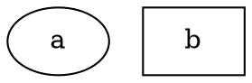
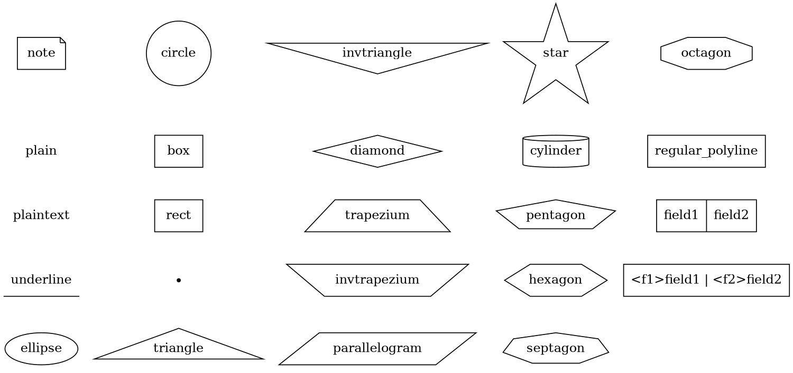

# Shape

Specifies the shape of the node. The shape of a node determines its appearance and how it will be rendered in the graph. 

**Usage**:

Dot



Java

```java
Node node = Node.builder()
    .shape(NodeShapeEnum.ELLIPSE)  // Set the shape of the node to ellipse
    .build();
```

## Available Shapes



