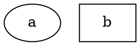
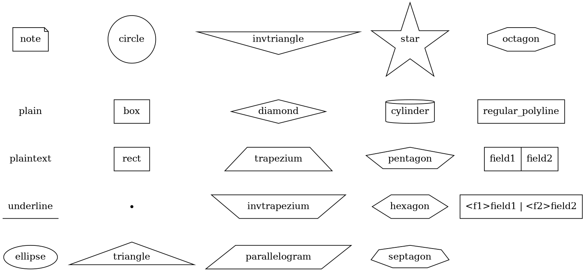
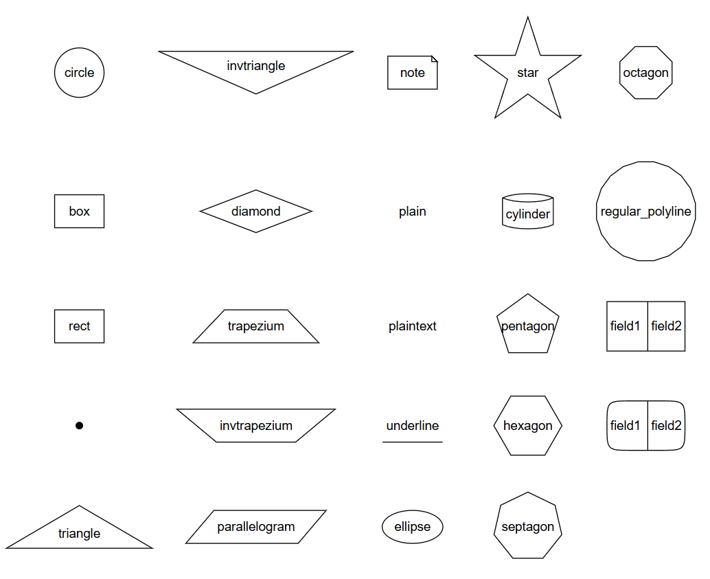

# Shape

See also [Regular](Regular.md) for controlling whether polygon-based shapes may stretch or must use
equal width and height.

Specifies the shape of the node. The shape of a node determines its appearance and how it will be rendered in the graph. 

**Usage**:

Dot


```dot
digraph G {
    node [shape=ellipse];  // Set the shape of all nodes to ellipse
    a;
    b [shape=box];  // Explicitly set the shape of node 'b' to box
}
```

Java

```java
Node node = Node.builder()
    .shape(NodeShapeEnum.ELLIPSE)  // Set the shape of the node to ellipse
    .build();
```

## Available Shapes

### Expanded Shapes

The following 17 node shapes are available in addition to the original shapes below:

| Shape name | Java `NodeShapeEnum` | Appearance |
| --- | --- | --- |
| `oval` | `OVAL` | Ellipse alias, a separate constant from `ELLIPSE` |
| `none` | `NONE` | Label only; no outline element is emitted, so there is nothing to fill |
| `rectangle` | `RECTANGLE` | Box/rect alias, a separate constant from `BOX` and `RECT` |
| `square` | `SQUARE` | Square |
| `polygon` | `POLYGON` | Configurable polygon, 3 to 20 sides via `sides`, four by default |
| `house` | `HOUSE` | House-shaped pentagon |
| `invhouse` | `INVHOUSE` | Inverted house |
| `doublecircle` | `DOUBLECIRCLE` | Circle with two outlines |
| `doubleoctagon` | `DOUBLEOCTAGON` | Octagon with two outlines |
| `tripleoctagon` | `TRIPLEOCTAGON` | Octagon with three outlines |
| `Mdiamond` | `M_DIAMOND` | Marked diamond |
| `Msquare` | `M_SQUARE` | Marked square |
| `Mcircle` | `M_CIRCLE` | Marked circle |
| `tab` | `TAB` | Tabbed box |
| `folder` | `FOLDER` | Folder |
| `box3d` | `BOX3D` | Three-dimensional box |
| `component` | `COMPONENT` | Simplified UML component box with inset terminals |

Each alias above is its own `NodeShapeEnum` constant, so `oval` resolves to `OVAL`
rather than to `ELLIPSE`, and `rectangle` resolves to `RECTANGLE` rather than to
`BOX` or `RECT`; the aliases only share geometry. Shape names are resolved by name,
never by position. These constants are declared after `M_RECORD` so that the
ordinals of the shapes that existed before them are unchanged.

### Polygon Sides

Use `sides` with `polygon` or `regular_polyline` to choose the number of sides;
the default is four. The supported range is **3 through 20, inclusive**.
`NodeBuilder#sides(int)` throws `IllegalArgumentException` outside that range, and
the DOT parser accepts the same values, so `sides=3` produces a three-sided polygon
directly.

```java
Node polygon = Node.builder()
    .shape(NodeShapeEnum.POLYGON)
    .sides(6)
    .build();

Node triangleFromPolygon = Node.builder()
    .shape(NodeShapeEnum.POLYGON)
    .sides(3)
    .build();
```

The corresponding DOT attributes are `shape=polygon, sides=6`. See
[Regular](Regular.md) for stretching versus equal width and height.

### Limitations

General `orientation`, `skew`, `distortion`, and `peripheries` attributes are not
supported. Named shapes such as `doublecircle` and `tripleoctagon` have fixed
outline counts; they do not imply support for arbitrary `peripheries` values.
Arrow shapes are also fixed choices: general arrow composition and the `l`/`r`
(left/right half) modifiers are not supported.

### Visual Gallery

`visual_case.ExpandedShapeTest#testExpandedShapeGallery` renders one compact graph
containing all 17 additions as filled/unfilled node pairs (`none` remains
outline-free). Labeled edges show all arrow choices, including filled and hollow
variants, at both head and tail with `dir=BOTH`. The existing `GraphvizVisual`
helper exercises `toSvg()` and adds SVG, PNG, and PDF previews to the visual index.

Run from the repository root, without another Maven run in progress:

```sh
mvn -pl test -am -Dtest=ExpandedShapeTest -Dsurefire.failIfNoSpecifiedTests=false test
```

Open `test/target/test-classes/visual/graph-visual.html` and filter by `gallery` or
`expanded-shape`.

### Original Shapes


```dot
digraph shapes_demo {
    size=10
    edge[style=invis]
    // Basic Shapes
    note           [shape=note           label="note"];
    plain          [shape=plain          label="plain"];
    plaintext      [shape=plaintext      label="plaintext"];
    underline      [shape=underline      label="underline"];
    ellipse        [shape=ellipse        label="ellipse"];
    circle         [shape=circle         label="circle"];
    box            [shape=box            label="box"];
    rect           [shape=rect           label="rect"];
    point          [shape=point          label="point"];
    triangle       [shape=triangle       label="triangle"];
    invtriangle    [shape=invtriangle    label="invtriangle"];
    diamond        [shape=diamond        label="diamond"];
    trapezium      [shape=trapezium      label="trapezium"];
    invtrapezium   [shape=invtrapezium   label="invtrapezium"];
    parallelogram  [shape=parallelogram  label="parallelogram"];
    star           [shape=star           label="star"];
    cylinder       [shape=cylinder       label="cylinder"];

    // Regular Polygons
    pentagon       [shape=pentagon       label="pentagon"];
    hexagon        [shape=hexagon        label="hexagon"];
    septagon       [shape=septagon       label="septagon"];
    octagon        [shape=octagon        label="octagon"];

    // Configurable polygon (4 sides by default)
    regular_polyline [shape=regular_polyline label="regular_polyline" sides=20];

    // Record-Based Shapes
    // Demonstrating a record with two fields
    record_example [shape=record   label="<f1>field1 | <f2>field2"];
    mrecord_example[shape=m_record label="<f1>field1 | <f2>field2"];

    note -> plain -> plaintext -> underline -> ellipse
    circle -> box -> rect -> point -> triangle
    invtriangle -> diamond -> trapezium -> invtrapezium -> parallelogram
    star -> cylinder -> pentagon -> hexagon -> septagon
    octagon -> regular_polyline -> record_example -> mrecord_example
}
```


