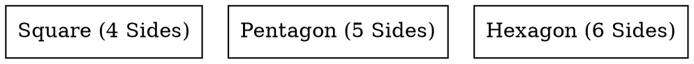

# Sides 

The **sides** attribute defines the **number of edges for `regular_polyline` shapes**. It allows the creation of polygonal nodes, but the **minimum supported value is 4**, meaning it cannot create triangles. (**Maximum supported value is 20**)

## Examples:

Dot



- **`sides=4`** → Creates a **square** (minimum supported value).
- **`sides=5`** → Creates a **pentagon**.
- **`sides=6`** → Creates a **hexagon**.

Java

```java
Node square = Node.builder()
    .label("Square (4 Sides)")
    .shape(NodeShapeEnum.REGULAR_POLYLINE) // Use regular polyline shape
    .sides(4) // 4 sides = Square (Minimum value)
    .build();

Node pentagon = Node.builder()
    .label("Pentagon (5 Sides)")
    .shape(NodeShapeEnum.REGULAR_POLYLINE)
    .sides(5) // 5 sides = Pentagon
    .build();

Node hexagon = Node.builder()
    .label("Hexagon (6 Sides)")
    .shape(NodeShapeEnum.REGULAR_POLYLINE)
    .sides(6) // 6 sides = Hexagon
    .build();
```

- **`sides(int n)`** → Defines the number of sides for `regular_polyline` shapes.
- **Minimum supported value is `4` (no triangles).**
- **Higher values (`sides=8, sides=12, etc.`) create more circular-like polygons.**